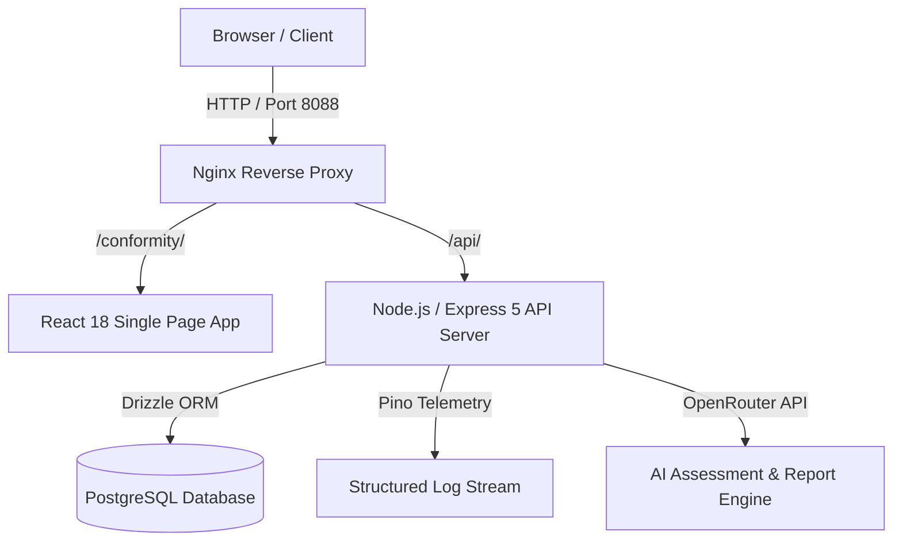
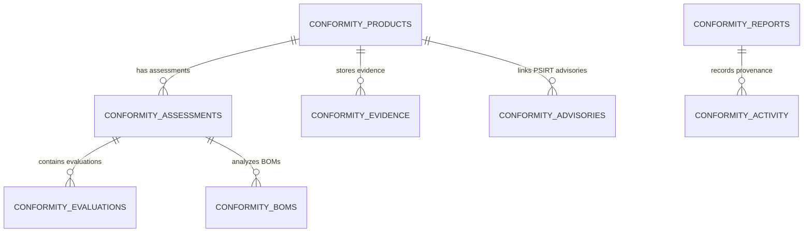

# OXOT Cyber Resilience Act (CRA) Statutory Conformity Application — Master Documentation & Architecture Wiki

Welcome to the canonical documentation wiki for the **OXOT Cyber Resilience Act (CRA) Statutory Conformity Application**. This document serves as the complete architectural, development, management, user, and deployment manual for the platform.

---

## Table of Contents

1. [Chapter 1: Executive Overview & Project Charter](#chapter-1-executive-overview--project-charter)
2. [Chapter 2: System Architecture & Data Model](#chapter-2-system-architecture--data-model)
3. [Chapter 3: Software & Version Specification Matrix](#chapter-3-software--version-specification-matrix)
4. [Chapter 4: Site Map & API Reference Directory](#chapter-4-site-map--api-reference-directory)
5. [Chapter 5: Deployment Guide A — Docker Containerization](#chapter-5-deployment-guide-a--docker-containerization)
6. [Chapter 6: Deployment Guide B — Railway Cloud Deployment](#chapter-6-deployment-guide-b--railway-cloud-deployment)
7. [Chapter 7: Management, Operations & Monitoring](#chapter-7-management-operations--monitoring)
8. [Chapter 8: Onboarding & Developer Guide ("Zero to Hero")](#chapter-8-onboarding--developer-guide-zero-to-hero)

---

## Chapter 1: Executive Overview & Project Charter

### 1.1 Mission & Regulatory Mandate
The **OXOT Conformity Application** provides an automated, enterprise-grade statutory compliance engine engineered for hardware and software manufacturers, authorized European representatives, and notified assessment bodies. 

The application directly satisfies statutory obligations under:
* **EU Cyber Resilience Act (CRA · Regulation EU 2024/2847)**: Articles 6, 10, 13, 14 & Annex I/IV technical dossier mandates.
* **NIS2 Directive (EU 2022/2555)**: Article 21 supply chain security controls.
* **IEC 62443-4-2**: Industrial automation security capability targets.

### 1.2 Core Architectural Capabilities
* **Statutory Conformity Wizard**: 4-stage guided assessment (`Scope` $\rightarrow$ `Standards Route` $\rightarrow$ `xBOM Vulnerability` $\rightarrow$ `EU Declaration of Conformity`).
* **Executive Portfolio Command Center**: Aggregated regulatory posture grades, grade distributions (A+ to F), and statutory deadline countdown timers.
* **PSIRT & Vulnerability Engine**: ISO 29147 / ISO 30111 vulnerability intake, CVE/CVSS 3.1 scoring, and statutory 24h/72h SLA breach tracking.
* **Cryptographic Dossier Generator**: AI-assisted executive report section drafting, Markdown customization, and SHA-256 digital signature sealing.
* **Statutory Document Vault**: 10-year product-isolated technical documentation vault satisfying CRA Article 13(13) retention laws.

---

## Chapter 2: System Architecture & Data Model

### 2.1 Workspace Directory Structure
The repository is structured as a pnpm monorepo:

```
OXOT_Website_Conformity_Application/
├── artifacts/
│   ├── conformity/          # Main React 18 Execution Workbench Frontend
│   │   ├── src/pages/       # Page views (products, psirt, reports, team, portfolio)
│   │   └── src/components/  # UI components, modals, and design tokens
│   ├── api-server/          # Express 5 Backend API Server
│   │   ├── src/routes/      # REST API route handlers
│   │   ├── src/lib/         # Logger, auth middleware, and helper utilities
│   │   └── src/routes/__tests__/ # Vitest diagnostic test suite
│   ├── oxot-web/            # Corporate Portal & Marketing Surface
│   └── customer-site/       # Customer-facing Documentation Surface
├── lib/
│   ├── api-client-react/    # Auto-generated React Query hooks
│   ├── api-zod/             # Zod validation schemas
│   └── db/                  # Drizzle ORM PostgreSQL schema definitions
├── docker/                  # Nginx configuration (nginx.conf)
├── Dockerfile               # Multi-stage Docker build specification
├── docker-compose.yml       # Container orchestration
└── pnpm-workspace.yaml      # Monorepo workspace configuration
```

### 2.2 System Architecture Diagram (Mermaid)



### 2.3 Database Entity-Relationship Overview



---

## Chapter 3: Software & Version Specification Matrix

| Component / Dependency | Exact Version / Spec | Description |
| :--- | :--- | :--- |
| **Node.js Runtime** | `v24.x-slim` | Base container runtime environment |
| **Package Manager** | `pnpm v10.x` | Monorepo package management & workspace linking |
| **Web Server / Proxy** | `Nginx 1.27-alpine` | Reverse proxy and static SPA server |
| **Database ORM** | `Drizzle ORM ^0.31.10` | Type-safe PostgreSQL ORM |
| **Database** | `PostgreSQL 16.x` | Relational database engine |
| **Backend Framework** | `Express v5.2.1` | REST API HTTP server |
| **Frontend UI** | `React v18.3.1` | Declarative user interface library |
| **Styling** | `Tailwind CSS v4.0.0` | CSS design token & utility framework |
| **Animation** | `Framer Motion v11.18.2` | Smooth layout transitions & micro-interactions |
| **Icons** | `Lucide React ^0.453.0` | Iconography suite |
| **Routing** | `Wouter ^3.3.5` | Lightweight client-side router |
| **Data Fetching** | `TanStack React Query ^5.59.16` | Async state management & caching |
| **Validation** | `Zod ^3.24.2` | Schema validation library |
| **Testing Framework** | `Vitest ^4.1.10` | Unit and integration test runner |

---

## Chapter 4: Site Map & API Reference Directory

### 4.1 Frontend Site Map

```
/                                   -> Executive Dashboard
/overview                           -> High-Level CRA Readiness Overview
/products                           -> Registered Products Directory
/products/:id                       -> Product Dossier & Assessment Kickoff
/assessments/:id                    -> Guided 4-Stage Conformity Assessment Wizard
/psirt                              -> PSIRT Incident Response & Advisory Workbench
/reports                            -> Statutory Executive Reports Manager
/reports/:id                        -> Interactive Report Drafting & Finalization Workspace
/product-portfolio                  -> Enterprise Customer Portfolio Operations
/team                               -> Assessor Team & Credentials Directory
/security                           -> Public CVD & Coordinated Disclosure Surface
/auditor-portal                     -> Notified Body Auditor Portal (Module B/H)
```

### 4.2 REST API Endpoint Directory

#### Products & Assessments
* `GET /api/conformity/products` — List all registered products.
* `POST /api/conformity/products` — Register a new product dossier.
* `GET /api/conformity/products/:id` — Fetch product details and linked assessments.
* `PUT /api/conformity/products/:id` — Update product statutory details.
* `DELETE /api/conformity/products/:id` — Delete product and cascade related entities.
* `POST /api/conformity/assessments` — Launch a CRA conformity assessment.
* `GET /api/conformity/assessments/:id` — Get assessment details and current stage.

#### Portfolio & Rollup Analytics
* `GET /api/conformity/portfolio/rollup` — Fetch overall grade, grade distribution, and deadline countdowns.

#### PSIRT & Advisory Engine
* `GET /api/conformity/advisories` — List published security advisories.
* `POST /api/conformity/advisories` — Publish a new CRA Article 14 security advisory.
* `GET /api/conformity/vuln-reports` — List vulnerability intake reports.
* `POST /api/conformity/vuln-reports` — Submit researcher vulnerability disclosure.

#### Statutory Reports Engine
* `GET /api/conformity/reports` — List generated executive compliance reports.
* `POST /api/conformity/reports` — Generate a new CRA executive dossier.
* `GET /api/conformity/reports/:id` — Get report structure and markdown sections.
* `PATCH /api/conformity/reports/:id/sections/:key` — Update section markdown content.
* `POST /api/conformity/reports/:id/finalize` — Seal report with cryptographic SHA-256 signature hash.

---

## Chapter 5: Deployment Guide A — Docker Containerization

### 5.1 Docker Architecture & Build Stages

The platform utilizes a 3-stage `Dockerfile`:
1. `build` stage: Installs `pnpm` dependencies, compiles TypeScript packages, and builds static frontend bundles.
2. `api` stage: Serves the Express 5 Node.js API server on port 5000.
3. `web` stage: Runs `Nginx 1.27-alpine` on port 8088 to reverse proxy API requests and serve static SPA assets.

### 5.2 Commands to Run Local Docker Stack

```bash
# Build images without cache and start containers
docker compose build --no-cache web api && docker compose up -d web api

# View container logs
docker compose logs -f api web

# Stop containers
docker compose down
```

---

## Chapter 6: Deployment Guide B — Railway Cloud Deployment

To deploy the application to **Railway.app** cloud PaaS:

### 6.1 Railway Setup Instructions

1. **Connect GitHub Repository**: Link your `planet9v/OXOT_Website_Conformity_Application` repository to Railway.
2. **Add PostgreSQL Service**: Add a Railway PostgreSQL database plugin to your project.
3. **Configure Environment Variables**:
   Set the following variables in Railway:
   - `DATABASE_URL` = `${{ Postgres.DATABASE_URL }}`
   - `NODE_ENV` = `production`
   - `PORT` = `5000`
   - `SESSION_SECRET` = `<your-secure-random-secret>`
   - `OPENROUTER_API_KEY` = `<your-openrouter-key>` (Optional for AI generation)

4. **Deploy via Dockerfile Target**:
   - Set Railway build pack to **Dockerfile**.
   - Railway will automatically detect the root `Dockerfile` and build the container image.

---

## Chapter 7: Management, Operations & Monitoring

### 7.1 Role-Based Access Control (RBAC)
* **`admin`**: Full access to all product dossiers, report finalization, team management, and configuration settings.
* **`member`**: Named assessors who can execute wizard stages, upload evidence files, and edit section drafts.
* **`demo`**: Public sandbox role allowing read and interactive evaluation without mutating persistent core state.

### 7.2 Telemetry & Diagnostic Logging
Structured logging is powered by `pino`. Logs include:
- `productId`, `actor`, and `updatedFields` on product mutations.
- SHA-256 signature hashes on report finalization.
- Request latency and HTTP status telemetry via `pino-http`.

---

## Chapter 8: Onboarding & Developer Guide ("Zero to Hero")

### 8.1 Local Setup Instructions

```bash
# 1. Install pnpm globally if not present
npm install -g pnpm

# 2. Install workspace dependencies
pnpm install

# 3. Typecheck libraries and packages
pnpm run typecheck:libs

# 4. Run automated diagnostic unit test suite (20 tests)
cd artifacts/api-server && npx vitest run src/routes/__tests__/usersAndPermissions.test.ts src/routes/__tests__/portfolioEngine.test.ts src/routes/__tests__/psirtVulnerabilityEngine.test.ts src/routes/__tests__/statutoryReportsEngine.test.ts
```

### 8.2 Summary of Diagnostic Test Coverage
- `usersAndPermissions.test.ts`: 5 tests green
- `portfolioEngine.test.ts`: 5 tests green
- `psirtVulnerabilityEngine.test.ts`: 4 tests green
- `statutoryReportsEngine.test.ts`: 6 tests green

Total: **20/20 Diagnostic Tests Passed**.
