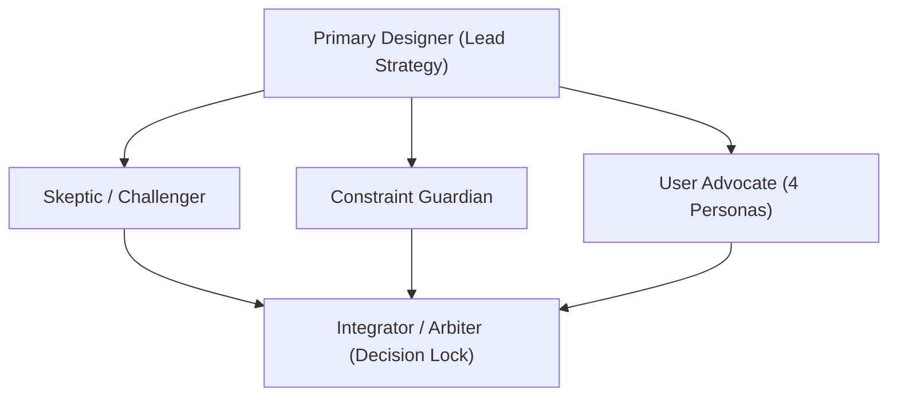
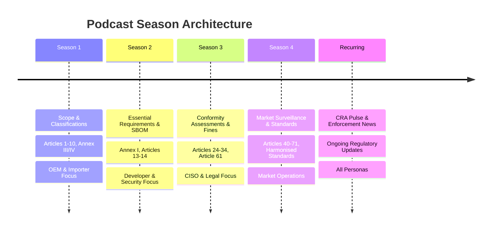

# Master Strategy & Production Architecture: The EU Cyber Resilience Act (CRA) Podcast

> **Executive Summary:** A comprehensive, multi-agent validated strategy to produce, structure, and scale an authoritative B2B/technical podcast covering Regulation (EU) 2024/2847 (Cyber Resilience Act). Tailored for OEMs, Manufacturers, Integrators/Operators, and Distributors.

---

## 1. Multi-Agent Brainstorming & Decision Log

Following the **`/multi-agent-brainstorming`** framework, this strategy was designed, challenged, constrained, and arbitrated across 5 specialized agent roles:



### Agent Contributions & Conflict Resolution

| Agent Role | Critical Objection / Input | Resolution & Design Modification |
|---|---|---|
| **Skeptic / Challenger** | *"A 71-article legal read-through will bore technical engineers, while high-level news commentary will lack legal defensibility for compliance officers."* | **Dual-Track Architecture:** Split every topic into a **Part A: Statutory Deep Dive** (10–12 min exact article/annex mechanics) and **Part B: Commercial & Technical Commentary** (12–15 min real-world impact by persona). |
| **Constraint Guardian** | *"Spotify/Apple RSS feeds collapse if episode titles aren't search-indexed by Article # and persona, making discovery impossible for an OEM searching specifically for 'SBOM requirements'."* | **Standardized Title & Tagging Schema:** Enforce `[CRA Ep. XX] Article YY: Title | Persona Impact (e.g. OEM / Integrator)` with exact timestamps in Spotify chapter markers. |
| **User Advocate (OEM / Mfr)** | *"Hardware OEMs don't care about legal Recitals until they know if their Product is Class I, Class II, or Uncritical, and what CE marking testing gate applies."* | **Foundational Season 1 Anchor:** Dedicate Episodes 1–4 exclusively to Scope, Product Classification (Annex III/IV), and Essential Requirements (Annex I). |
| **User Advocate (Integrator)** | *"Integrators are terrified of legacy OT hardware maintenance obligations when CRA takes effect in Sep 2026 / Dec 2027."* | **Operational Commentary Track:** Every episode features a dedicated 3-minute section titled *"System Integrator & Asset Operator Reality Check"*. |
| **Integrator / Arbiter** | **FINAL DISPOSITION: APPROVED.** Validated 4-season content roadmap, 3-tier corpus foundation, and automated Azure OpenAI / NotebookLM podcast audio pipeline. |

---

## 2. Target Audience Personas & Jobs-To-Be-Done (JTBD)

```
                       +-----------------------------------+
                       |    CRA PODCAST AUDIENCE ECOSYSTEM  |
                       +-----------------------------------+
                                         |
         +-----------------------+-------+-------+-----------------------+
         |                       |               |                       |
         v                       v               v                       v
+-----------------+     +-----------------+ +-----------------+ +-----------------+
|   PERSONA 1     |     |   PERSONA 2     | |   PERSONA 3     | |   PERSONA 4     |
|   Hardware &    |     | Software & SaaS | | System Integrity| | Distributors &  |
|   Component OEM |     |  Vendor (SaaS)  | |  & OT Operator  | | Importers (Dist) |
+-----------------+     +-----------------+ +-----------------+ +-----------------+
| Pain: Testing & |     | Pain: 24h/72h   | | Pain: Legacy OT | | Pain: Liability  |
| CE Marking Gate |     | Incident Clocks | | Patching Risk   | | & Verification  |
+-----------------+     +-----------------+ +-----------------+ +-----------------+
```

### Detailed Persona Mapping

1. **Persona 1: Hardware & Component OEMs (Original Equipment Manufacturers)**
   * **Core Focus:** Article 6 (Categories), Annex I (Secure Design), Annex III (Important/Critical Products), Article 24 (Conformity Assessment Modules).
   * **JTBD:** *"Help me determine if my micro-controller or gateway requires 3rd-party audit, and how to build secure-by-default firmware to pass CE marking."*

2. **Persona 2: Software & SaaS Vendors**
   * **Core Focus:** Article 3 (Remote Data Processing scope), Article 13 (Manufacturer Obligations), Article 14 (Mandatory Incident & Vulnerability Reporting within 24h/72h to ENISA/CSIRTs).
   * **JTBD:** *"Give me exact workflows for automated SBOM export (CycloneDX/SPDX) and 24-hour vulnerability disclosure clocks."*

3. **Persona 3: System Integrators & OT Operators**
   * **Core Focus:** Article 18 (Installer/Integrator obligations when modifying products), IEC 62443 integration, legacy machine retrofits.
   * **JTBD:** *"Tell me what happens when I integrate a non-CRA compliant sensor into a Purdue Level 2 network after Dec 10, 2027."*

4. **Persona 4: Distributors, Importers & Economic Operators**
   * **Core Focus:** Article 19 (Importer Obligations), Article 20 (Distributor Obligations), Article 61 (Administrative Fines up to €15M or 2.5% turnover).
   * **JTBD:** *"How do I verify CE declarations of conformity and technical documentation before stocking products to avoid multi-million euro liability?"*

---

## 3. Podcast Brand Architecture & Show Naming

### Recommended Title: **"The Cyber Resilience Act Briefing"**
* **Subtitle:** *Statutory Breakdown, Technical Guidance & Market Impact for EU Hardware and Software Compliance.*
* **Tagline:** *From Article to Architecture.*

#### Alternative Naming Options (A/B Testing Variants):
* **Option B (Technical & Engineering Focus):** *"CRA Unlocked: Secure by Design"*
* **Option C (Executive & Commercial Focus):** *"CE Mark Cybersecurity: The CRA Compliance Pod"*
* **Option D (Short & Punchy):** *"Cyber Resilience Pulse"*

---

## 4. Spotify & Apple Podcast Structure (Corpus & Season Plan)



### Season 1: Scope, Definitions & Product Classifications (Articles 1–12)
* **Corpus Provided:** Regulation (EU) 2024/2847 Chapter I & II; Recitals 1–25; Annex III (Important Products Class I & II); Annex IV (Critical Products).
* **Episode Breakdown:**
  * **Ep 1.01:** *Is Your Product In Scope? Decoding Article 2 & Remote Data Processing.*
  * **Ep 1.02:** *Uncritical vs. Class I vs. Class II: Navigating Annex III Taxonomies (OEM Guide).*
  * **Ep 1.03:** *Open Source Software & The CRA: What Commercial Stewards Must Know (Recital 10).*
  * **Ep 1.04:** *Substantial Modifications: When Does a Patch Trigger Re-certification? (Article 18).*

### Season 2: Essential Cybersecurity Requirements & Vulnerability Handling (Annex I & Articles 13–14)
* **Corpus Provided:** Annex I Part I (Security Properties) & Part II (Vulnerability Handling); Articles 13 & 14; ENISA Reporting Guidelines; ETSI EN 303 645 cross-walk.
* **Episode Breakdown:**
  * **Ep 2.01:** *Secure by Default: Demystifying Annex I Section 1 Essential Requirements.*
  * **Ep 2.02:** *The 24h/72h Reporting Clock: Article 14 Incident Notification to ENISA & CSIRTs.*
  * **Ep 2.03:** *SBOMs in Practice: Machine-Readable Dependency Tracking (CycloneDX/SPDX).*
  * **Ep 2.04:** *Support Periods & EOL: Defining Mandatory Patching Lifecycles (Article 13(8)).*

### Season 3: Conformity Assessment Modules, CE Marking & Penalty Risk (Articles 24–34 & Article 61)
* **Corpus Provided:** Articles 24 (Conformity Assessment Routes), Annex VI (Modules A, B, C, H); Article 61 (Penalties); IEC 62443-4-1/4-2 alignment.
* **Episode Breakdown:**
  * **Ep 3.01:** *Self-Assessment vs. Third-Party Audits: Choosing Module A, B+C, or H.*
  * **Ep 3.02:** *The €15,000,000 Risk: Article 61 Fines & Executive Liability Explained.*
  * **Ep 3.03:** *CE Marking Mechanics: Technical Documentation & EU Declaration of Conformity.*
  * **Ep 3.04:** *Notified Bodies & Testing Labs: Avoiding the 2026 Conformity Bottleneck.*

### Season 4: Market Surveillance, Harmonised Standards & International Alignment
* **Corpus Provided:** Articles 40–55; CEN/CENELEC Standardization Requests (JTC 13); NIS2 & EU AI Act Overlays.
* **Episode Breakdown:**
  * **Ep 4.01:** *Harmonised European Standards: How Presumption of Conformity Works.*
  * **Ep 4.02:** *CRA meets NIS2 & EU AI Act: Navigating Overlapping EU Regulations.*
  * **Ep 4.03:** *Market Surveillance & Recalls: What Happens When a Product is Non-Compliant.*
  * **Ep 4.04:** *Global Impact: How Non-EU Manufacturers Selling into the EU Must Adapt.*

### Recurring Series: "CRA Pulse & Enforcement News" (Bi-Weekly / Monthly)
* **Format:** 15-minute news & commentary episodes.
* **Content:** New CEN/CENELEC standard drafts, ENISA portal launches, Notified Body designations, market surveillance actions, statutory countdown milestones (10 Sep 2026 / 10 Dec 2027).

---

## 5. Episode Blueprint & Show Format (Spotify Schema)

To maximize engagement and clarity, every episode follows a strict **3-Segment Formula**:

```
+-------------------------------------------------------------------------+
| TOTAL DURATION: 20 - 25 MINUTES                                         |
+-------------------------------------------------------------------------+
| 00:00 - 03:00 | SEGMENT 1: The Statutory Fact Sheet (Pure Specification)  |
| 03:00 - 15:00 | SEGMENT 2: Deep Dive & Persona Impact (OEM/Integrator)  |
| 15:00 - 22:00 | SEGMENT 3: Technical Implementation & Checklist         |
| 22:00 - 25:00 | SEGMENT 4: Q&A / Regulatory News Update                 |
+-------------------------------------------------------------------------+
```

### Standardized Spotify Show Notes Template:
```markdown
# [CRA Ep. 2.02] The 24h/72h Reporting Clock: Article 14 Incident Notification to ENISA

In this episode of The Cyber Resilience Act Briefing, we break down Article 14 of Regulation (EU) 2024/2847. Learn exact notification timelines, platform mechanics, and what software vendors must prepare before September 10, 2026.

⏱️ TIMESTAMPS & CHAPTER MARKERS:
00:00 - Introduction & Key Statutory Milestones
02:15 - Part A: Article 14 Breakdown (Early Warning vs. Full Notification)
08:30 - Part B: OEM & Software Vendor Impact (24-Hour Clock Trigger)
14:45 - Part C: Technical Workflow: Integrating CSIRT Alerts into PSIRT Operations
21:10 - Actionable Takeaway Checklist for CISOs & Product Managers

📚 STATUTORY REFERENCES & RESOURCES:
• Regulation (EU) 2024/2847, Article 14 & Recital 54
• ENISA Single Reporting Platform Specifications
• Free CRA Compliance Assessment Tool: https://oxot.ai/cra-check
```

---

## 6. Technical Audio Production & AI Synthesis Pipeline

Using the **`podcast-generation`** skill, episodes can be produced autonomously or in hybrid co-host mode using Azure OpenAI's Realtime API / NotebookLM architecture:

```python
VOICE_CONFIG = {
    "host_legal": "onyx",        # Deep, Authoritative tone
    "host_engineering": "nova",   # Warm, Technical tone
    "sample_rate": 24000,
    "format": "audio/wav"
}
```

### Production Checklist:
1. **Source Script / Ingestion:** Feed raw statutory markdown (`docs/statutory-curation/2026-08-13/`) directly into the prompt pipeline.
2. **Audio Rendering:** Generate dual-voice dialogue using PCM 24kHz audio stream.
3. **Mastering & Leveling:** Normalize audio to -16 LUFS (podcast broadcast standard) with soft limiter.
4. **Metadata & Distribution:** Push to Spotify for Podcasters / Apple Podcasts via automated RSS feed with ID3 chapter tags.
