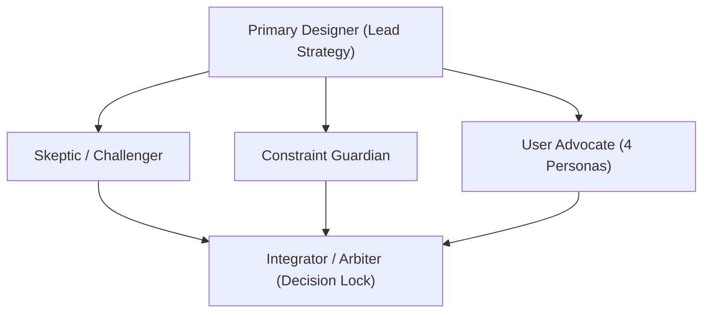

# Master Strategy & Production Architecture: The EU Cyber Resilience Act (CRA) Podcast
## Canonical 8-Series, 50-Episode Engineering & Executive Master Roadmap

> **Executive Summary:** A comprehensive, multi-agent validated strategy to produce, structure, and scale an authoritative B2B/technical podcast covering Regulation (EU) 2024/2847 (Cyber Resilience Act). Tailored for OEMs, Manufacturers, Integrators/Operators, and Distributors.
> **Host & Presenter:** Jim Mckenney (Digital Product Security Consultant)  
> **Universal Episode Scheme:** `EP_S.EE` (Series 1 to 8, 50 Episodes Total)

---

## 1. Universal Corpus Architecture (8 Miniseries / 50 Episodes)

```
+----------------------------------------------------------------------------------------------------+
|                                  THE 8 THEMATIC MINISERIES (50 EPISODES)                           |
+----------------------------------------------------------------------------------------------------+
| Series 1: The Procurement & Contracting Crisis (EP_1.01 - EP_1.06)                                 |
| Series 2: The System Integrator & EPC Shield (EP_2.01 - EP_2.07)                                   |
| Series 3: Brownfield OT, Spare Parts & Maintenance (EP_3.01 - EP_3.06)                              |
| Series 4: Tier-2 Upstream Component Supplier Survival (EP_4.01 - EP_4.06)                          |
| Series 5: Critical Sector Deep Dives (EP_5.01 - EP_5.08)                                           |
| Series 6: Vulnerability Operations, PSIRT & 24h Clocks (EP_6.01 - EP_6.06)                          |
| Series 7: Conformity Assessment, Audits & CE Marking (EP_7.01 - EP_7.06)                           |
| Series 8: Executive Liability, Penalties & Future Evolution (EP_8.01 - EP_8.05)                     |
+----------------------------------------------------------------------------------------------------+
```

---

## 2. Multi-Agent Brainstorming & Decision Log

Following the **`/multi-agent-brainstorming`** framework, this strategy was designed, challenged, constrained, and arbitrated across 5 specialized agent roles:



### Agent Contributions & Conflict Resolution

| Agent Role | Critical Objection / Input | Resolution & Design Modification |
|---|---|---|
| **Skeptic / Challenger** | *"A 71-article legal read-through will bore technical engineers, while high-level news commentary will lack legal defensibility for compliance officers."* | **Dual-Track Architecture:** Split every topic into a **Part A: Statutory Deep Dive** (10–12 min exact article/annex mechanics) and **Part B: Commercial & Technical Commentary** (12–15 min real-world impact by persona). |
| **Constraint Guardian** | *"Spotify/Apple RSS feeds collapse if episode titles aren't search-indexed by Article # and persona, making discovery impossible for an OEM searching specifically for 'SBOM requirements'."* | **Standardized Title & Tagging Schema:** Enforce `[CRA EP_S.EE] Title | Persona Impact (e.g. OEM / Integrator)` with exact timestamps in Spotify chapter markers. |
| **User Advocate (OEM / Mfr)** | *"Hardware OEMs don't care about legal Recitals until they know if their Product is Class I, Class II, or Uncritical, and what CE marking testing gate applies."* | **Series Alignment:** Dedicate Series 7 exclusively to Conformity Assessment Modules A, B+C, and H, and Series 4 to Tier-2 component suppliers. |
| **User Advocate (Integrator)** | *"Integrators are terrified of legacy OT hardware maintenance obligations when CRA takes effect in Sep 2026 / Dec 2027."* | **Operational Commentary Track:** Dedicated Series 2 (*The System Integrator & EPC Shield*) and Series 3 (*Brownfield OT, Spare Parts & Maintenance*). |
| **Integrator / Arbiter** | **FINAL DISPOSITION: APPROVED.** Validated 8-series content roadmap, single-host Jim Mckenney narrative, and dedicated master Outro marketing separation. |

---

## 3. Target Audience Personas & Jobs-To-Be-Done (JTBD)

```
                       +-----------------------------------+
                       |    CRA PODCAST AUDIENCE ECOSYSTEM  |
                       +-----------------------------------+
                                         |
         +-----------------------+-------+-------+-----------------------+
         |                       |               |                       |
         v                       v               v                       v
+-----------------+     +-----------------+ +-----------------+ +-----------------+
|   PERSONA 1     |     |   PERSONA 2     | |   PERSONA 3     | |   PERSONA 4     |
|   Hardware &    |     | Software & SaaS | | System Integrity| | Distributors &  |
|   Component OEM |     |  Vendor (SaaS)  | |  & OT Operator  | | Importers (Dist) |
+-----------------+     +-----------------+ +-----------------+ +-----------------+
| Pain: Testing & |     | Pain: 24h/72h   | | Pain: Legacy OT | | Pain: Liability  |
| CE Marking Gate |     | Incident Clocks | | Patching Risk   | | & Verification  |
+-----------------+     +-----------------+ +-----------------+ +-----------------+
```

### Detailed Persona Mapping

1. **Persona 1: Hardware & Component OEMs (Original Equipment Manufacturers)**
   * **Core Focus:** Article 6 (Categories), Annex I (Secure Design), Annex III (Important/Critical Products), Article 24 (Conformity Assessment Modules).
   * **JTBD:** *"Help me determine if my micro-controller or gateway requires 3rd-party audit, and how to build secure-by-default firmware to pass CE marking."*

2. **Persona 2: Software & SaaS Vendors**
   * **Core Focus:** Article 3 (Remote Data Processing scope), Article 13 (Manufacturer Obligations), Article 14 (Mandatory Incident & Vulnerability Reporting within 24h/72h to ENISA/CSIRTs).
   * **JTBD:** *"Give me exact workflows for automated SBOM export (CycloneDX/SPDX) and 24-hour vulnerability disclosure clocks."*

3. **Persona 3: System Integrators & OT Operators**
   * **Core Focus:** Article 21 (Substantial Modification), Article 18(2) (Duty to Refrain), IEC 62443 integration, legacy machine retrofits.
   * **JTBD:** *"Tell me what happens when I integrate a non-CRA compliant sensor into a Purdue Level 2 network after Dec 10, 2027."*

4. **Persona 4: Distributors, Importers & Economic Operators**
   * **Core Focus:** Article 19 (Importer Obligations), Article 20 (Distributor Obligations), Article 61 (Administrative Fines up to €15M or 2.5% turnover).
   * **JTBD:** *"How do I verify CE declarations of conformity and technical documentation before stocking products to avoid multi-million euro liability?"*

---

## 4. Audio Branding & Outro Marketing Separation

To uphold maximum editorial integrity and listener trust:
1. **0% Inline Directives:** All individual episode transcripts focus purely on technical, engineering, and statutory analysis. No sales pitches or mid-roll website directives.
2. **Dedicated Master Outro:** All platform marketing, diagnostic tool references, and website URLs (`oxot.ai`) are housed exclusively in [`EP_0.00_PODCAST_INTRO_OUTRO_ELEVENLABS_SCRIPTS_SOLO.md`](file:///Users/jimmcknney/Downloads/OXOT_Website_Conformity_Application/docs/cra_podcast/episodes_solo/EP_0.00_PODCAST_INTRO_OUTRO_ELEVENLABS_SCRIPTS_SOLO.md) over acoustic Spanish classical guitar beds.
3. **Clean Episode Sign-Off:** Every episode closes with the authoritative sign-off:
   *"Until next time: build secure by design, protect your supply chain, and ship with confidence. I'm Jim Mckenney—thank you for listening."*
