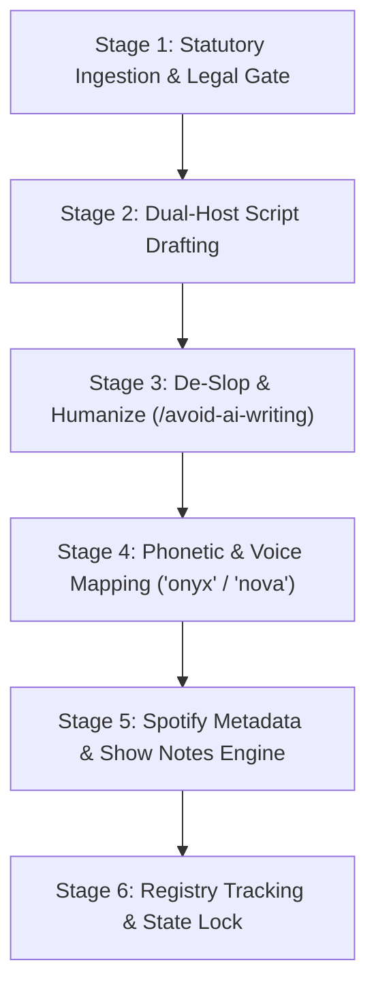

## 1. Dual-Format Workflow & Output Directories

Every episode in the 16-episode series is produced in **two distinct formats**:
1. **Two-Voice Series:** Host 1 (Legal Lead - 'onyx') & Host 2 (Engineering Lead - 'nova') $\rightarrow$ output to `docs/cra_podcast/episodes/EP_X.YY_<Slug>.md`
2. **Jim Mckenney Solo Series:** Digital Product Security Consultant Narrative $\rightarrow$ output to `docs/cra_podcast/episodes_solo/EP_X.YY_<Slug>_SOLO.md`

> **Output Location Rule:** All generated audio files (`.wav` / `.m4a`) must output directly into their respective tracked directory (`docs/cra_podcast/episodes/` or `docs/cra_podcast/episodes_solo/`).



### Executed Skill Chain:
1. **`oxot-marketing`**: Defines persona hooks, financial risk ALE/VaR metrics, and B2B pain points.
2. **`podcast-generation`**: Controls dual-voice dialogue format (Host 1 'onyx' Legal vs Host 2 'nova' Engineering) and PCM audio rendering.
3. **`avoid-ai-writing`**: Audits and rewrites prose to eliminate 21 categories of AI-isms, corporate buzzwords, formulaic transitions, and monotonous cadences.
4. **`content-creator`**: Produces Spotify chapter markers, timestamps, show notes, and search-indexed episode titles.
5. **`planning-with-files`**: Tracks episode states (`backlog` -> `drafted` -> `de_slopped` -> `voice_mapped` -> `published`) in `task_plan.md` and `episodes_registry.json`.

---

## 2. The 6-Stage Episode Production Pipeline

### Stage 1: Statutory Ingestion & Legal Gate
* **Input:** Target Episode ID, Persona, and Statutory Article/Annex selection from `docs/statutory-curation/2026-08-13/`.
* **Action:** Extract raw text, Recitals, official citations, and cross-regulation mappings.
* **Output:** Clean **Statutory Fact Sheet** (Zero hallucinations).

### Stage 2: Multi-Pass Dual-Host Dialogue Drafting
* **Pass 2A (Structural Outline):**
  * Segment 1 (00:00–03:00): Legal Fact Sheet (Article mechanics).
  * Segment 2 (03:00–15:00): Persona Deep Dive (OEM / Developer / Integrator impact).
  * Segment 3 (15:00–22:00): Technical Implementation Checklist.
  * Segment 4 (22:00–25:00): Q&A / Regulatory News Update.
* **Pass 2B (Dialogue Synthesis):**
  * **Host 1 (Legal Lead - 'onyx'):** Authoritative, precise, cites exact statutory text and Recitals.
  * **Host 2 (Engineering Lead - 'nova'):** Pragmatic, inquisitive, translates legal clauses into firmware, SBOMs, and architecture.

### Stage 3: De-Slop & Humanize Pass (`/avoid-ai-writing`)
* **Mandatory Rules:**
  * **No Buzzwords:** Strip *delve, leverage, pivotal landscape, testament to, seamlessly, robust, game-changer, holistic, crucial, foster, embark*.
  * **Standardized Outro Sign-Off:** *"Until next time: build secure by design, ship with confidence. I'm Jim Mckenney—thanks for listening."* (Short, clever, and never references Purdue layers/models).
  * **Natural Conversational Flow:** Use contractions (*don't, can't, here's, what's*), short sentence variations, interjections, and natural host banter.

### Stage 4: Voice, Phonetic & ElevenLabs Production Standard (`podcast-generation`)
* **ElevenLabs Voice Specification:**
  * **Jim Mckenney Solo Voice ID:** `Jim Mckenney English` (`fh7rGvh0nJR3MFMkM9yd`).
  * **Tuned Voice Parameters:** `stability=0.60`, `similarity_boost=0.85`, `style=0.10`, `use_speaker_boost=true`.
  * **Voice Model:** `eleven_multilingual_v2`.
* **Mandatory Text Pre-Processing & Sanitization:**
  * **Strip Speaker & Section Tags:** Remove `[JIM MCKENNEY]`, `[HOST 1]`, `## SECTION 2`, and metadata before API payload dispatch.
  * **Convert Phonetic Brackets to Clean Prose:**
    * ❌ `Regulation [pronunciation: EU twenty-twenty-four slash twenty-eight-forty-seven]`
    * ✅ `Regulation E U twenty twenty-four slash twenty-eight forty-seven`
  * **Strip Markdown Artifacts:** Remove bold/italic asterisks (`*logical*` $\rightarrow$ `logical`), blockquotes (`>`), headers (`#`), and footer instructions.
* **Paragraph Payload Chunking Rule:**
  * Chunk text into 300–800 character paragraphs per API call. Never exceed 1,500 characters per call to prevent voice stuttering, word skipping, or scrambled cadence.
* **Audio Ducking & Music Layering:**
  * **Intro:** 2.0s Spanish Classical Guitar swell $\rightarrow$ duck music volume to -12dB under Jim Mckenney's voice intro $\rightarrow$ fade out.
  * **Outro:** Jim Mckenney sign-off speech $\rightarrow$ Spanish Classical Guitar resolving chord swell $\rightarrow$ 3s fade out.
* **FFmpeg Re-Encoding Rule:**
  * Never use `-c copy` across distinct MP3 streams. Re-encode concatenated audio streams via `libmp3lame` at `192kbps` to ensure smooth frame alignment and seamless duration calculations.

### Stage 5: Spotify & Apple Podcasts Packaging Engine (`content-creator`)
* **Output Package:**
  1. **SEO Episode Title:** `[CRA Ep. X.YY] Article Z: Title | Persona Impact`
  2. **Timestamped Chapter Markers:** `00:00 Intro`, `02:15 Fact Sheet`, `08:30 Persona Impact`, `14:45 Technical Checklist`.
  3. **Show Notes (250 words):** Includes statutory references, episode summary, and link to free assessment tool (`https://oxot.ai/cra-check`).
  4. **Key Takeaway Bullet Points:** 3 actionable takeaways for listeners.

### Stage 6: Registry State Lock & File Creation
* **Output Path:** `docs/cra_podcast/episodes/EP_X.YY_<Slug>.md`
* **Action:** Update `docs/cra_podcast/task_plan.md` and `docs/cra_podcast/episodes_registry.json`.

---

## 3. Episode State Registry Schema (`episodes_registry.json`)

```json
{
  "episodes": [
    {
      "id": "EP_1.01",
      "season": 1,
      "episode_number": 1,
      "title": "Is Your Product In Scope? Decoding Article 2 & Remote Data Processing",
      "target_persona": "Software & Hardware OEMs",
      "statutory_articles": ["Article 2", "Article 3", "Recitals 4-7"],
      "status": "drafting_ready",
      "file_path": "docs/cra_podcast/episodes/EP_1.01_Is_Your_Product_In_Scope.md"
    }
  ]
}
```

---

## 4. Single-Episode Prompt Execution Command Template

To generate any episode on demand, run the workflow with the following targeted prompt format:

```markdown
Generate CRA Podcast Episode [EP_ID] using the 6-Stage Episode Pipeline:
- Episode ID: EP_1.01
- Title: Is Your Product In Scope? Decoding Article 2 & Remote Data Processing
- Target Persona: Software & Hardware OEMs
- Statutory Corpus: CRA Articles 2 & 3, Recitals 4-7
- Execute Stage 1 through Stage 6, applying /avoid-ai-writing to Stage 3.
```
