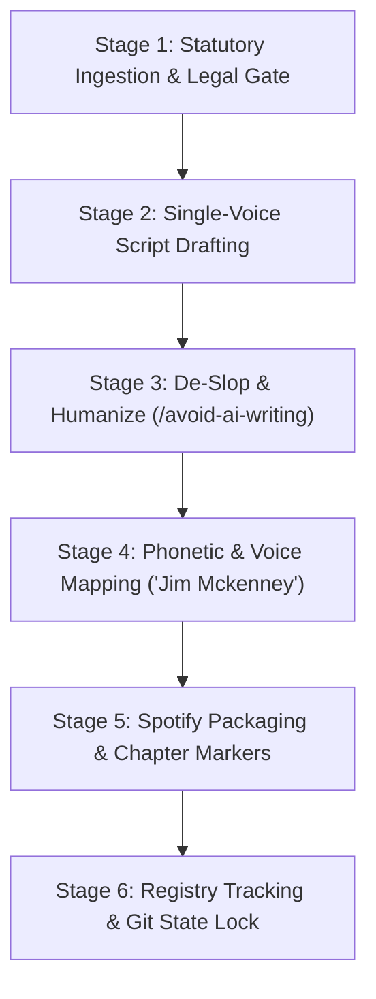

# Repeatable Episode Production Workflow: The CRA Podcast
## Standard Operating Procedure for Solo & Studio Audio Generation

> **Workflow Standard:** Multi-Agent Validated Production Pipeline (50 Episodes across 8 Miniseries)  
> **Host & Presenter:** Jim Mckenney (Digital Product Security Consultant)  
> **Universal Episode Code:** `EP_S.EE` (e.g. `EP_1.01` to `EP_8.05`)  
> **Target Output Path:** `docs/cra_podcast/episodes_solo/`

---

## 1. Unified 6-Stage Episode Production Pipeline

### Executed Skill Chain:
1. **`/legal-advisor`**: Validates statutory accuracy against Regulation (EU) 2024/2847, NLF directives, and official Recitals.
2. **`/marketing-psychology` & `/copywriting`**: Crafts high-retention narrative hooks, loss aversion framing, and clear 4-step action checklists.
3. **`/avoid-ai-writing`**: Eliminates corporate buzzwords (*delve, leverage, pivotal, testament, seamlessly, crucial*) and ensures spoken cadence.
4. **`podcast-generation`**: Controls single-voice dialogue audio synthesis and acoustic guitar music bed ducking.

---

## 2. Detailed Production Stages

### Stage 1: Statutory Ingestion & Legal Gate
* **Input:** Episode Canonical Code (`EP_S.EE`), Persona, and Statutory Articles from `docs/statutory-curation/2026-08-14/`.
* **Action:** Extract raw text, Recitals, official citations, and cross-regulation mappings.
* **Output:** Clean **Statutory Fact Sheet** with zero legal hallucinations.

### Stage 2: Single-Voice Narrative Drafting
* **Pass 2A (Structural Breakdown):**
  * Segment 1 (00:00–01:30): Executive Hook & The Real-World Dilemma.
  * Segment 2 (01:30–05:15): Statutory Architecture & Regulatory Breakdown.
  * Segment 3 (05:15–08:45): Operational Impact & Plant Engineering Realities.
  * Segment 4 (08:45–11:30): Engineering Mitigation & Supply Chain Governance.
  * Segment 5 (11:30–13:50): 4-Step Actionable Checklist for Engineering Teams.
  * Segment 6 (13:50–14:30): Authoritative Closure & Sign-Off.

### Stage 3: De-Slop & Humanize Pass (`/avoid-ai-writing`)
* **Mandatory Rules:**
  * **No Buzzwords:** Strip *delve, leverage, pivotal landscape, testament to, seamlessly, robust, game-changer, holistic, crucial, foster, embark*.
  * **0% Inline Marketing:** Never include website URLs, sales pitches, or software directives in the episode body. All platform marketing is housed in the dedicated outro.
  * **Standardized Sign-Off:** *"Until next time: build secure by design, protect your supply chain, and ship with confidence. I'm Jim Mckenney—thank you for listening."*

### Stage 4: Voice, Phonetic & Audio Production Standard (`podcast-generation`)
* **ElevenLabs Voice Specification:**
  * **Voice Model:** `Jim Mckenney English` (`fh7rGvh0nJR3MFMkM9yd`).
  * **Tuned Voice Parameters:** `stability=0.60`, `similarity_boost=0.85`, `style=0.10`, `use_speaker_boost=true`.
  * **Voice Engine:** `eleven_multilingual_v2`.
* **Acoustic Guitar Ducking & Music Layering:**
  * **Intro:** 2.0s Spanish Classical Guitar swell $\rightarrow$ duck volume to -14dB under Jim Mckenney's voice intro $\rightarrow$ fade out cleanly.
  * **Episode Body:** Dry vocal narration with crisp broadcast warmth.
  * **Dedicated Outro:** Standalone audio file (`EP_0.00`) containing platform CTA over resolving Spanish guitar chords.

### Stage 5: Spotify & Apple Podcasts Packaging Engine (`content-creator`)
* **Output Package:**
  1. **SEO Episode Title:** `[CRA EP_S.EE - Solo Briefing] Title | Jim Mckenney`
  2. **Timestamped Chapter Markers:** `00:00 Intro`, `01:30 Statutory Breakdown`, `05:15 Industry Impact`, `11:30 Action Checklist`.
  3. **Show Notes:** Statutory references, key takeaway points, and deep link to statutory wiki.

### Stage 6: Registry State Lock & File Creation
* **Output Path:** `docs/cra_podcast/episodes_solo/EP_S.EE_<Slug>_SOLO.md`
* **Action:** Update `docs/cra_podcast/episodes_registry.json` and `00-SOLO-EPISODES-CATALOGUE.md`.
