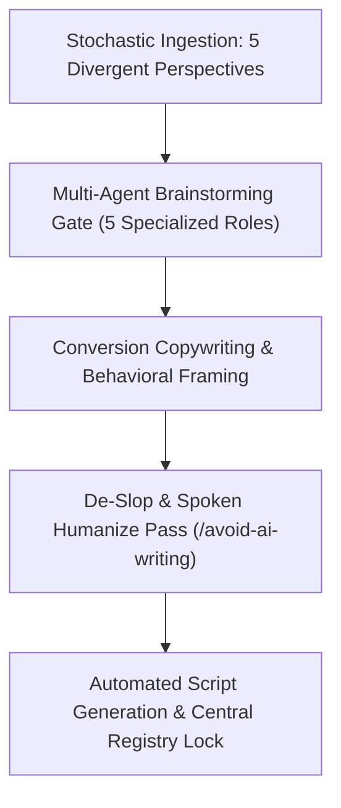

# Universal CRA Podcast Discovery, Brainstorming & Production Engine
## Automated Workflow Specification for Continuous Topic Discovery & Script Generation
### Upgraded with `/kaizen` Multi-Perspective Stochastic Research & Uncertainty Discovery

> **Workflow Classification:** Continuous Improvement Discovery & Production Pipeline  
> **Host & Presenter:** Jim Mckenney (Digital Product Security Consultant)  
> **Universal Episode Code Scheme:** `EP_S.EE` (Series 1 to 10+, 62 Episodes Total)  
> **Integrated Tooling:** Perplexity AI (`perplexity-ask`) + Web Search + `/multi-agent-brainstorming` + `/copywriting` + `/marketing-psychology` + `/avoid-ai-writing`

---

## 1. Kaizen Multi-Perspective Discovery Engine Architecture



```
+----------------------------------------------------------------------------------------------------+
| 5 DIVERGENT RESEARCH PERSPECTIVES (STOCHASTIC SAMPLING)                                            |
+---------------------+------------------------------------------------------------------------------+
| Perspective 1:      | Real-world JTAG dumping, binary decompilation, backdoor detection, firmware  |
| Red Team & Exploits | memory corruption, CAN bus injection, and supply chain tampering.           |
+---------------------+------------------------------------------------------------------------------+
| Perspective 2:      | VDMA, ZVEI, BDI, ANSSI, and BSI positions on Notified Body lab shortages,   |
| Conservative OEMs   | certification cost inflation, and international export friction.             |
+---------------------+------------------------------------------------------------------------------+
| Perspective 3:      | Dusty 1995 serial Modbus skids, ATEX explosive zones, midnight commissioning  |
| Field Integrators   | retrofits, and stopping customer delay liquidated damages.                   |
+---------------------+------------------------------------------------------------------------------+
| Perspective 4:      | Port of Rotterdam / Antwerp customs seizures, EU Safety Gate alerts,         |
| Market Surveillance | and Article 61 corporate turnover fine modeling (up to €15M / 2.5%).         |
+---------------------+------------------------------------------------------------------------------+
| Perspective 5:      | Lloyd's / Munich Re underwriting conditions precedent, Product Liability    |
| Insurers & PE M&A   | Directive 2024 strict fault presumptions, and M&A cyber debt audits.         |
+---------------------+------------------------------------------------------------------------------+
```

---

## 2. Multi-Agent Review & Decision Log Standard (`/multi-agent-brainstorming`)

Every synthesized series passes sequentially through 5 constrained agent roles:
1. **Primary Designer:** Ingests research signals and proposes 6 structured episode blueprints.
2. **Skeptic / Challenger:** Challenges non-obvious failure modes (*"Assume industry ignores this topic. What concrete event forces them to comply?"*).
3. **Constraint Guardian:** Enforces the `EP_S.EE` naming convention, exact statutory citations (Articles, Recitals, Annexes), and 12–15 minute spoken duration.
4. **User Advocate:** Verifies shop-floor engineering realism and Purdue model level accuracy.
5. **Integrator / Arbiter:** Issues formal disposition (`APPROVED`, `REVISE`, or `REJECT`) and updates central registers.

---

## 3. Production & Distribution Portfolio Overview (62 Total Episodes)

```
+----------------------------------------------------------------------------------------------------+
| THE 10 MASTER MINISERIES (62 EPISODES TOTAL)                                                       |
+----------------------------------------------------------------------------------------------------+
| Series 1: The Procurement & Contracting Crisis (EP_1.01 - EP_1.06)                                 |
| Series 2: The System Integrator & EPC Shield (EP_2.01 - EP_2.07)                                   |
| Series 3: Brownfield OT, Spare Parts & Maintenance (EP_3.01 - EP_3.06)                              |
| Series 4: Tier-2 Upstream Component Supplier Survival (EP_4.01 - EP_4.06)                          |
| Series 5: Critical Sector Deep Dives (EP_5.01 - EP_5.08)                                           |
| Series 6: Vulnerability Operations, PSIRT & 24h Clocks (EP_6.01 - EP_6.06)                          |
| Series 7: Conformity Assessment, Audits & CE Marking (EP_7.01 - EP_7.06)                           |
| Series 8: Executive Liability, Penalties & Future Evolution (EP_8.01 - EP_8.05)                     |
| Series 9: The CRA Frontier & Market Uncertainty (EP_9.01 - EP_9.06)                                |
| Series 10: Deep Tech, Energy & Extreme Infrastructure (EP_10.01 - EP_10.06)                         |
+----------------------------------------------------------------------------------------------------+
```
