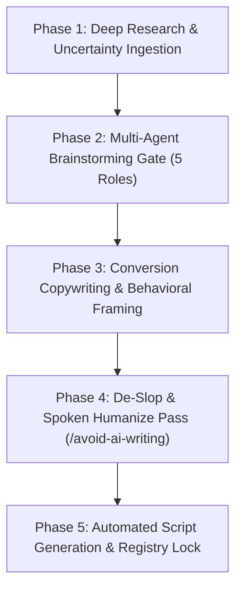

# Universal CRA Podcast Discovery, Brainstorming & Production Engine
## Automated Workflow Specification for Continuous Topic Discovery & Script Generation

> **Workflow Classification:** Multi-Agent Validated Production Engine (Research $\rightarrow$ Review $\rightarrow$ Copy $\rightarrow$ De-Slop $\rightarrow$ Output)  
> **Host & Presenter:** Jim Mckenney (Digital Product Security Consultant)  
> **Universal Episode Code Scheme:** `EP_S.EE` (Series 1 to 9+)  
> **Execution Engine:** `/multi-agent-brainstorming` + `/copywriting` + `/marketing-psychology` + `/avoid-ai-writing`

---

## 1. The 5-Phase End-to-End Discovery & Production Pipeline



---

## 2. Detailed Phase Breakdowns

### Phase 1: Deep Research & Market Uncertainty Ingestion
* **Objective:** Identify genuine market confusion, non-obvious regulatory friction, and emerging technical edge cases under Regulation (EU) 2024/2847.
* **Input Sources:**
  1. Statutory Edge Cases: Interactions between CRA, NIS2, EU AI Act, Machinery Regulation (EU) 2023/1230, and ATEX Directive 2014/34/EU.
  2. Industrial OT Realities: Cloud/edge hybrid microservices, defunct OEM bankruptcies, AI neural weights in firmware, and cross-border firmware supply chain interception.
  3. Market Surveillance Precedents: ICS-CERT advisories, BSI, ANSSI, and NCSC-NL enforcement patterns.
* **Gate Check:** Must verify that the topic is NOT already covered in the existing 50-episode baseline.

### Phase 2: Multi-Agent Brainstorming & Review Loop (`/multi-agent-brainstorming`)
Every new series or episode must pass through 5 sequential agent gates with an explicit Decision Log:

1. **Primary Designer (Lead Strategy):** Drafts the episode concept, core statutory hook, and target engineering persona.
2. **Skeptic / Challenger:** Stress-tests the concept: *"Assume an asset owner or vendor ignores this episode. Why would they say this is irrelevant, and what empirical counter-argument proves them wrong?"*
3. **Constraint Guardian:** Enforces non-functional boundaries: strict compliance with `EP_S.EE` naming, 12–15 min audio duration, exact statutory citations, and zero legal hallucinations.
4. **User Advocate:** Audits cognitive load from the perspective of plant engineers, procurement directors, and CISOs: *"Is this too abstract? Does it provide concrete, shop-floor action steps?"*
5. **Integrator / Arbiter (Decision Lock):** Issues the formal disposition (`APPROVED`, `REVISE`, or `REJECT`) and signs off on the final outline.

### Phase 3: Conversion Copywriting & Psychological Framing (`/copywriting` & `/marketing-psychology`)
* **Core Framing Principles:**
  * **Loss Aversion:** Frame costs around unmitigated regulatory fines (Article 61: €15M / 2.5% turnover) and project stop-work orders.
  * **Status-Quo Bias Disruption:** Shatter legacy assumptions (*"You think cloud container updates are outside CRA scope? Here is why your CE mark just vanished."*).
  * **Clarity Over Cleverness:** Direct, benefit-first episode titles that rank for high-intent B2B search terms.
  * **Zeigarnik Open Loops:** Structuring the narrative around unsolved industrial dilemmas that resolve into 4-step action checklists.

### Phase 4: De-Slop & Editorial Polishing (`/avoid-ai-writing`)
* **Mandatory Rules:**
  * Strip all 21 categories of AI tells: *delve, leverage, pivotal landscape, testament to, seamlessly, robust, holistic, crucial, foster, embark*.
  * **0% Inline Marketing:** Never include website URLs or software sales pitches in the spoken dialogue body.
  * **Phonetic Pronunciation Guides:** Explicit bracketed notation for complex statutes (`[pronunciation: EU twenty-twenty-four slash twenty-eight-forty-seven]`).
  * **Clean Sign-Off:** *"Until next time: build secure by design, protect your supply chain, and ship with confidence. I'm Jim Mckenney—thank you for listening."*

### Phase 5: Automated Generation & Registry State Lock
* **Automated Output Artifacts:**
  1. Spoken markdown transcript in `docs/cra_podcast/episodes_solo/EP_S.EE_<Slug>_SOLO.md`.
  2. Updated `episodes_registry.json` tracking canonical codes, series metadata, and completion status.
  3. Updated master catalogue `docs/cra_podcast/episodes_solo/00-SOLO-EPISODES-CATALOGUE.md`.
  4. Git commit and central memory persistence.

---

## 3. Decision Log Template for New Series Conception

```markdown
### Multi-Agent Decision Log: Series [X] Conception
- **Series Code & Title:** Series X: [Title]
- **Target Persona:** [Primary Stakeholder]
- **Core Market Uncertainty:** [What question does this series answer?]
- **Skeptic Challenge & Resolution:** [Key objection resolved]
- **Constraint Guardian Verification:** [Format, length & citation checks verified]
- **User Advocate Validation:** [Shop-floor engineering reality verified]
- **Final Disposition:** APPROVED by Integrator / Arbiter
```
