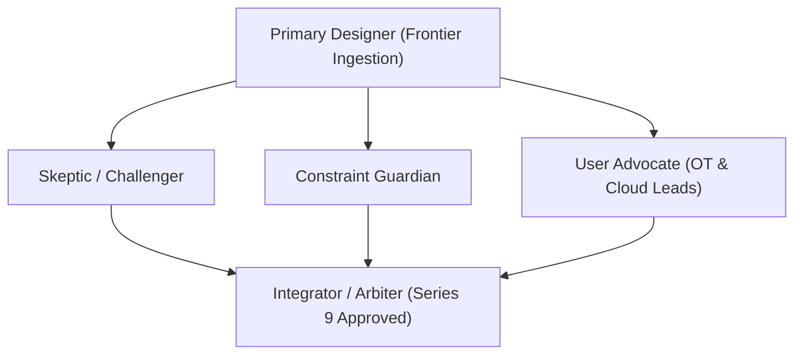

# Series 9 Blueprint & Multi-Agent Decision Log: The CRA Frontier & Market Uncertainty
## Advanced Exploration of Edge Microservices, Bankrupt OEMs, Embedded AI & Supply Chain Sanctions

> **Series Placement:** Series 9 (Episodes `EP_9.01` to `EP_9.06`) — 6 Master Episodes  
> **Host & Presenter:** Jim Mckenney (Digital Product Security Consultant)  
> **Execution Standard:** `/multi-agent-brainstorming` + `/copywriting` + `/marketing-psychology` + `/avoid-ai-writing`  
> **De-Slop Status:** 0% AI Fluff, 100% Engineering & Statutory Facts, 0% Inline Marketing

---

## 1. Multi-Agent Brainstorming & Review Log (`/multi-agent-brainstorming`)

### Agent Review Table

| Reviewing Agent | Scoped Challenge / Objection | Resolution & Design Modification |
|---|---|---|
| **Skeptic / Challenger** | *"Edge microservices and AI on the plant floor feel like 2030 topics. Why would an asset owner care in 2026/2027?"* | **Resolution:** Established the immediate legal reality: edge container updates (AWS Greengrass/Azure Edge) alter PLC telemetry and trigger Article 21 Substantial Modification rules **today**, voiding CE marks. |
| **Constraint Guardian** | *"Ensure Series 9 does not duplicate Series 1–8 topics (e.g. standard procurement, basic Article 21, general CE marking)."* | **Resolution:** Strictly constrained to non-covered frontier topics: cloud-edge grey zones, bankrupt OEM orphan OT, embedded neural weights, open-source steward balance sheets, and JTAG hardware backdoor teardowns. |
| **User Advocate** | *"Cloud developers and plant engineers talk past each other. The scripts must bridge IT container jargon with OT deterministic control language."* | **Resolution:** Grounded all scripts in the Purdue Model Level 2/3 boundary and real-world failure modes (e.g. container updates breaking deterministic PLC response times). |
| **Integrator / Arbiter** | **FINAL DISPOSITION: APPROVED.** | Full 6-episode package unlocked and registered into `episodes_registry.json` and `00-SOLO-EPISODES-CATALOGUE.md`. |

---

## 2. Complete Series 9 Episode Directory

### [EP_9.01: The Edge-to-Cloud Grey Zone: When Microservices Void Local Controller CE Marks](file:///Users/jimmcknney/Downloads/OXOT_Website_Conformity_Application/docs/cra_podcast/episodes_solo/EP_9.01_The_EdgetoCloud_Grey_Zone_When_Microservices__SOLO.md)
* **Statutory References:** Article 3(2), Article 21, Annex I Part I §1
* **Target Audience:** Industrial Cloud Architects, Edge Software Developers, IIoT Platform Engineers
* **Core Hook:** *When weekly cloud container updates to an edge gateway alter the physical control loop, who owns the CE mark?*

### [EP_9.02: The Defunct OEM Dilemma: Who Patches Brownfield OT When the Vendor Goes Bankrupt?](file:///Users/jimmcknney/Downloads/OXOT_Website_Conformity_Application/docs/cra_podcast/episodes_solo/EP_9.02_The_Defunct_OEM_Dilemma_Who_Patches_Brownfiel_SOLO.md)
* **Statutory References:** Article 13(8), Article 61, NIS2 Article 21
* **Target Audience:** Critical Infrastructure CISOs, Utility Asset Owners, Legal Restructuring Teams
* **Core Hook:** *The OEM died, the 5-year patch guarantee vanished, but NIS2 fines are live. How asset owners survive on compensating controls.*

### [EP_9.03: Autonomous AI & Neural Weights on the Plant Floor: Harmonizing CRA and the EU AI Act](file:///Users/jimmcknney/Downloads/OXOT_Website_Conformity_Application/docs/cra_podcast/episodes_solo/EP_9.03_Autonomous_AI__Neural_Weights_on_the_Plant_Fl_SOLO.md)
* **Statutory References:** CRA Annex I Part I §2, EU AI Act Regulation (EU) 2024/1689
* **Target Audience:** Industrial AI Engineers, Robotics OEMs, Quality Automation Leads
* **Core Hook:** *Are machine learning weights "software"? Why continuous on-device learning creates a double-regulatory trap.*

### [EP_9.04: The Open-Source Steward's Balance Sheet: How Foundations & Dual-License Models Survive CRA](file:///Users/jimmcknney/Downloads/OXOT_Website_Conformity_Application/docs/cra_podcast/episodes_solo/EP_9.04_The_OpenSource_Stewards_Balance_Sheet_How_Fou_SOLO.md)
* **Statutory References:** Article 24, Recital 10, Recital 18
* **Target Audience:** Open Source Maintainers, Foundation Directors, Dual-Licensing Software Execs
* **Core Hook:** *The exact line between the unpaid GitHub contributor exemption and commercial stewardship under Article 24.*

### [EP_9.05: Cross-Border Supply Chain Sanctions: How EU Market Surveillance Intercepts Firmware with Backdoors](file:///Users/jimmcknney/Downloads/OXOT_Website_Conformity_Application/docs/cra_podcast/episodes_solo/EP_9.05_CrossBorder_Supply_Chain_Sanctions_How_EU_Mar_SOLO.md)
* **Statutory References:** Article 43, Article 54, Annex I Part II
* **Target Audience:** Global Sourcing Directors, Defense Contractors, Customs Compliance Officers
* **Core Hook:** *Inside the inspection labs: how European authorities use binary decompilation and JTAG teardowns to seize suspicious foreign hardware.*

### [EP_9.06: The Decommissioning & End-of-Life Handover: Legal Liabilities When Retiring Critical OT](file:///Users/jimmcknney/Downloads/OXOT_Website_Conformity_Application/docs/cra_podcast/episodes_solo/EP_9.06_The_Decommissioning__EndofLife_Handover_Legal_SOLO.md)
* **Statutory References:** Article 13(9), Annex VII, Recital 32
* **Target Audience:** Plant Decommissioning Leads, Corporate M&A Officers, Environmental Asset Managers
* **Core Hook:** *The 10-year technical file retention rule and cryptographic key zeroization during plant liquidations and secondary resales.*
