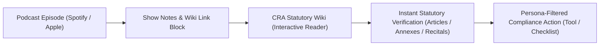

# CRA Buyer Persona Strategy & Statutory Wiki Integration Playbook
## Comprehensive Kaizen Roadmap for Audience Appeal, Educational Authority & Cross-Platform Engagement

> **Strategic Framework:** Industrial B2B Audience Architecture & Educational Flywheel  
> **Applicable Regulation:** Regulation (EU) 2024/2847 (Cyber Resilience Act)  
> **Integrated Platform:** CRA Statutory Wiki (`/conformity/cra-wiki`) + 62-Episode Solo Podcast Series (`docs/cra_podcast/episodes_solo/`)  
> **Evaluation Tools:** `/multi-agent-brainstorming` + `/marketing-psychology` + `/copywriting` + `/avoid-ai-writing` + `/kaizen`

---

## 1. The 6 Core CRA Buyer Personas (Psychological Deep Dive)

To build genuine credibility and command attention across European industry, every episode is tailored to the distinct financial, legal, and operational anxieties of six key stakeholder personas:

```
+----------------------------------------------------------------------------------------------------+
|                                THE 6 CRA BUYER PERSONAS ECOSYSTEM                                  |
+----------------------------------------------------------------------------------------------------+
| 1. Industrial OEM Head of R&D / Embedded Systems VP                                                |
|    - Anxiety: Notified Body audit backlogs, BOM cost inflation, secure boot hardware upgrades.     |
|    - Core Job: "Help me pass CE marking testing gates without redesigning my hardware from scratch."|
+----------------------------------------------------------------------------------------------------+
| 2. Industrial System Integrator & EPC Managing Director (e.g. Axians, Spie, Actemium)              |
|    - Anxiety: Article 21 Substantial Modification reclassification, client delay liquidated damage. |
|    - Core Job: "Give me safe-harbor integration contracts so I don't inherit €15M OEM liabilities."|
+----------------------------------------------------------------------------------------------------+
| 3. Critical Infrastructure Plant CISO / Asset Operator (Energy, Water, Rail, Data Centers)         |
|    - Anxiety: Brownfield OT vulnerabilities, orphan hardware from bankrupt OEMs, NIS2 compliance. |
|    - Core Job: "Show me how to defend legacy plant controllers using compensating network controls."|
+----------------------------------------------------------------------------------------------------+
| 4. General Counsel, Chief Risk Officer & Board Director                                            |
|    - Anxiety: Article 64 turnover fines (2.5% global turnover), personal D&O liability, insurance.  |
|    - Core Job: "Protect the balance sheet from catastrophic regulatory sanctions and stop-orders." |
+----------------------------------------------------------------------------------------------------+
| 5. Tier-2 Embedded Component & Sensor Supplier                                                     |
|    - Anxiety: OEM customer supply-chain delisting, expensive third-party audit confusion.          |
|    - Core Job: "Give me the Minimum Viable Security Kit to keep my Tier-1 accounts profitably."    |
+----------------------------------------------------------------------------------------------------+
| 6. European Importer & Master Distributor                                                          |
|    - Anxiety: Article 19 full manufacturer liability for non-EU hardware, unsellable warehouse stock.|
|    - Core Job: "Provide a foolproof due diligence verification checklist before clearing customs." |
+----------------------------------------------------------------------------------------------------+
```

---

## 2. What Was Missing in Traditional CRA Discourse (The 4 Gap Areas)

Through our `/kaizen` review, we identified four critical voids in existing market content that our podcast series systematically fills:

1. **The Notified Body Lead Auditor Perspective**:
   - *The Missing Insight:* Exactly what test evidence, vulnerability triage logs, and crypto documentation lead assessors at TÜV, DEKRA, and BSI expect to see in an Annex VII technical file.
   - *How We Answer:* Series 7 (`EP_7.01`–`EP_7.06`) dissects Module A vs. B+C vs. H testing criteria and pre-compliance lab validation.

2. **The Contract Arbitration & EPC Dispute Perspective**:
   - *The Missing Insight:* What happens when project schedules slip by 12 months because an automation OEM discontinued a pre-CRA controller mid-construction.
   - *How We Answer:* Series 1 (`EP_1.01`–`EP_1.06`) and Series 2 (`EP_2.01`–`EP_2.07`) provide exact bilateral variation order clauses and risk-sharing formulas.

3. **The 24-Hour Zero-Day Incident Command Countdown**:
   - *The Missing Insight:* Hour-by-hour operational workflows from the moment a researcher discloses an unauthenticated RCE exploit to submitting the Early Warning notification on the ENISA Single Reporting Platform.
   - *How We Answer:* Series 6 (`EP_6.01`–`EP_6.06`) maps the forensic payload expectations of national CSIRTs.

4. **The Insurance Underwriting & Product Liability Defect Link**:
   - *The Missing Insight:* How CRA non-conformities trigger strict liability defect presumptions under the new EU Product Liability Directive and void Cyber / Tech E&O insurance claims.
   - *How We Answer:* Series 8 (`EP_8.01`–`EP_8.05`) and Series 10 (`EP_10.06`) explain insurer warranty conditions precedent.

---

## 3. The CRA Statutory Wiki Integration Flywheel

To transform the podcast from passive audio into an indispensable educational companion, every episode is linked directly to the interactive **CRA Statutory Wiki** (`/conformity/cra-wiki`):



### Direct Deep Linking Architecture
* **Article Deep Links:** `http://localhost:8088/conformity/cra-wiki?tab=articles&num=21` $\rightarrow$ Opens Article 21 (Substantial Modification) directly.
* **Annex Deep Links:** `http://localhost:8088/conformity/cra-wiki?tab=annexes&num=1` $\rightarrow$ Opens Annex I (Essential Cybersecurity Requirements).
* **Recital Deep Links:** `http://localhost:8088/conformity/cra-wiki?tab=recitals&num=24` $\rightarrow$ Opens Recital 24 (Integrator liability intent).
* **Persona Filter Deep Links:** `http://localhost:8088/conformity/cra-wiki?persona=integrator` $\rightarrow$ Filters the entire statute by persona obligations.

---

## 4. Top 10 Editorial Rules for Maximum Listener Appeal & High Retention

1. **Lead with the Shocking Financial/Operational Truth (0:00–0:45)**: Hook the listener in the first 30 seconds with an undeniable commercial reality (e.g. *"Your 2024 contract just became legally contraband at the port gate"*).
2. **Shatter the Status-Quo Myth (0:45–2:30)**: State the common industry misconception, then quote the exact statutory text that disproves it.
3. **No Corporate Fluff or Academic Jargon (`/avoid-ai-writing`)**: Speak directly in the voice of a senior digital product security consultant on the shop floor.
4. **Concrete Shop-Floor Examples**: Reference real PLCs, SCADA networks, Modbus/BACnet/IEC 61850 protocols, and hazardous ATEX environments.
5. **Clear 4-Step Action Checklist (11:30–13:30)**: Give listeners immediate, actionable engineering tasks they can execute the same week.
6. **Statutory Wiki Cross-Reference**: Invite listeners to inspect the exact statutory wording in the CRA Wiki for empirical validation.
7. **Consistent Spanish Guitar Audio Branding**: Open with warm acoustic Spanish classical guitar chords that signal high-end executive broadcast quality.
8. **0% Inline Marketing in Narrative**: Keep the spoken monologue 100% focused on technical substance; reserve platform URLs exclusively for the dedicated master outro (`EP_0.00`).
9. **Universal `EP_S.EE` Numbering**: Maintain clear series and episode groupings across all audio files, scripts, and documentation.
10. **High-Agency Closure**: Close every episode with the authoritative motto: *"Until next time: build secure by design, protect your supply chain, and ship with confidence."*
