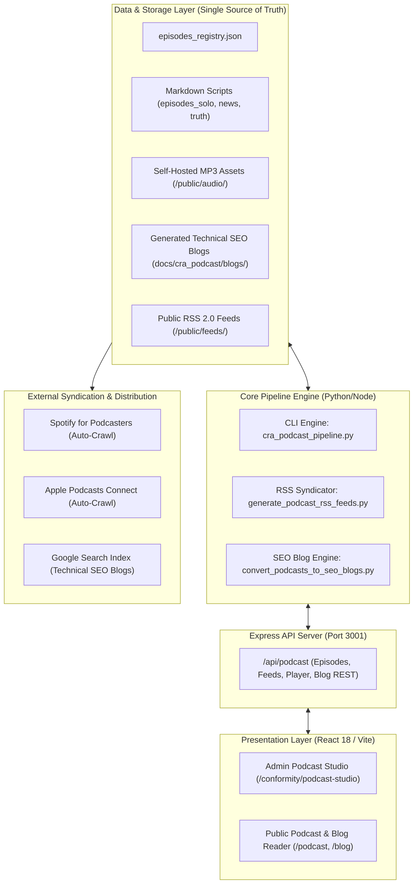

# CRA Podcast Web Studio, Automated RSS Syndication & SEO Blog Architecture
## Complete Architecture Specification for Headless Dual-Interface Media & Blog Engine

> **Framework:** `/architecture-patterns` (Headless Dual-Interface & Git-Backed CMS)  
> **Platform Version:** 5.0.0  
> **Integration Surface:** React 18 / Vite Web App (`/conformity/podcast-studio`) + Express API + CLI Pipeline (`scripts/cra_podcast_pipeline.py`)  
> **Syndication Standard:** RSS 2.0 + iTunes Namespace (Apple Podcasts, Spotify, Amazon Music)  
> **SEO Companion Engine:** Automated Markdown/MDX Blog Generation with Mermaid Diagrams

---

## 1. System Architecture Diagram



---

## 2. The Dual-Interface Principle: CLI + Web Studio

```
+----------------------------------------------------------------------------------------------------+
|                                    DUAL-INTERFACE RESPONSIBILITY MATRIX                            |
+---------------------+------------------------------------------------------------------------------+
| 1. Autonomous CLI   | • Primary for AI agents, CI/CD pipelines, bulk generation, linter audits,    |
|    Engine (Python)  |   and headless automated synthesis.                                          |
|                     | • Command: python3 scripts/cra_podcast_pipeline.py                           |
+---------------------+------------------------------------------------------------------------------+
| 2. Web Admin Studio | • Visual cockpit for human editors, executives, and compliance leads.        |
|    (React 18 / Vite)| • Features: Waveform audio streaming, full-text transcript search, 3-style   |
|                     |   filters, one-click script generation, and direct RSS copy links.           |
|                     | • Route: http://localhost:8088/conformity/podcast-studio                     |
+---------------------+------------------------------------------------------------------------------+
| 3. Public Web Blog  | • High-ranking technical SEO companion articles with interactive diagrams,   |
|    & Knowledge Hub  |   4-step downloadable checklists, and direct CRA Statutory Wiki deep links.  |
|                     | • Route: http://localhost:8088/conformity/blogs                              |
+---------------------+------------------------------------------------------------------------------+
```

---

## 3. Automated RSS 2.0 / iTunes XML Specification

To ensure automatic syndication to **Spotify**, **Apple Podcasts**, and **Amazon Music**, our engine generates three distinct, valid feeds in `/public/feeds/`:

1. `cra-podcast.xml`: Standard Solo Series (50 Episodes, Category: *Technology / Industrial Cybersecurity*)
2. `cra-news.xml`: The CRA News Stream (Breaking Bulletins)
3. `cra-truth.xml`: CRA: Truth & Consequences (Investigative Series)

### Feed XML Template (Apple & Spotify Compliant):
```xml
<?xml version="1.0" encoding="UTF-8"?>
<rss version="2.0" xmlns:itunes="http://www.itunes.com/dtds/podcast-1.0.dtd" xmlns:content="http://purl.org/rss/1.0/modules/content/">
  <channel>
    <title>The Cyber Resilience Act Briefing | Jim Mckenney</title>
    <link>https://oxot.ai/podcast</link>
    <language>en-us</language>
    <itunes:author>Jim Mckenney</itunes:author>
    <itunes:summary>Practical, no-FUD engineering and legal analysis of Regulation (EU) 2024/2847 for industrial OT and critical infrastructure.</itunes:summary>
    <itunes:image href="https://oxot.ai/assets/podcast_cover_art.png"/>
    <itunes:category text="Technology">
      <itunes:category text="Tech News"/>
    </itunes:category>
    <itunes:explicit>no</itunes:explicit>
    <item>
      <title>[EP_1.01] The 2-Year Lag: Why 2024 Contracts Are Walking into a 2027 Regulatory Trap</title>
      <link>https://oxot.ai/podcast/ep-1-01</link>
      <guid isPermaLink="false">cra-ep-1-01</guid>
      <pubDate>Fri, 14 Aug 2026 12:00:00 GMT</pubDate>
      <enclosure url="https://oxot.ai/audio/cra_podcast/EP_1.01.mp3" length="24500000" type="audio/mpeg"/>
      <itunes:duration>13:45</itunes:duration>
      <itunes:author>Jim Mckenney</itunes:author>
      <description><![CDATA[Full statutory breakdown of Article 2 and Article 71 for EPC contractors and procurement leads...]]></description>
    </item>
  </channel>
</rss>
```

---

## 4. The Podcast-to-SEO Blog Transformation Pipeline

Every episode script is automatically compiled into an authoritative, long-form technical article:

```
+----------------------------------------------------------------------------------------------------+
| PODCAST-TO-BLOG TRANSFORMATION ANATOMY                                                             |
+---------------------+------------------------------------------------------------------------------+
| 1. Targeted H1      | Search-intent optimized title (e.g. "How System Integrators Avoid Article 21 |
|                     | Substantial Modification Liabilities Under EU CRA")                          |
+---------------------+------------------------------------------------------------------------------+
| 2. Executive Hook   | The core commercial dilemma and real-world operational tension.             |
+---------------------+------------------------------------------------------------------------------+
| 3. Statutory Deep   | Exact statutory text analysis with direct clickable links to the CRA Wiki.   |
|    Dive             |                                                                              |
+---------------------+------------------------------------------------------------------------------+
| 4. Architecture     | Embedded Mermaid diagrams (Purdue model zoning, secure boot flowcharts,     |
|    Diagrams         | CycloneDX SBOM build pipelines).                                             |
+---------------------+------------------------------------------------------------------------------+
| 5. Action Checklist | Downloadable 4-step engineering and legal checklist.                         |
+---------------------+------------------------------------------------------------------------------+
| 6. Embedded Audio   | HTML5 stream player directly listening to the corresponding MP3 file.       |
+---------------------+------------------------------------------------------------------------------+
```
