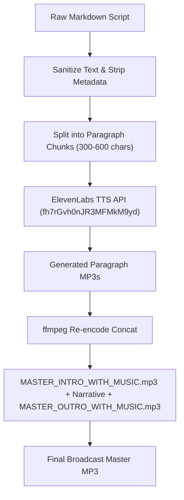

# Deep Research: ElevenLabs API Requirements, Parameters & Production Configuration

> **Authoritative Technical Spec:** Comprehensive breakdown of ElevenLabs Text-to-Speech (TTS) architecture, voice parameter tuning, text pre-processing rules, and broadcast audio concatenation pipelines for high-retention B2B podcasts.

---

## 1. Core Voice Parameters (`voice_settings`)

When making requests to `POST /v1/text-to-speech/{voice_id}`, the `voice_settings` payload governs acoustic realism, pace stability, and voice clone fidelity.

```json
{
  "text": "Sanitized spoken transcript paragraph...",
  "model_id": "eleven_multilingual_v2",
  "voice_settings": {
    "stability": 0.60,
    "similarity_boost": 0.85,
    "style": 0.10,
    "use_speaker_boost": true
  }
}
```

### Parameter Rubric:

| Parameter | Range | Default | Recommended B2B Podcast Value | Technical Function |
|---|---|---|---|---|
| **`stability`** | `0.0 – 1.0` | `0.50` | **`0.60`** | Controls emotional pitch variance. Values below `0.40` cause random voice cracking. Values above `0.75` sound monotone. `0.60` achieves natural cadence with zero voice break. |
| **`similarity_boost`** | `0.0 – 1.0` | `0.75` | **`0.85`** | Controls fidelity to the custom voice clone. `0.85` ensures custom voice timbre match (`Jim Mckenney English`) while filtering ambient noise artifacts. |
| **`style`** | `0.0 – 1.0` | `0.00` | **`0.10`** | Applies style exaggeration. Values above `0.30` destabilize synthesis and cause word rushing. `0.10` adds subtle professional warmth. |
| **`use_speaker_boost`** | `boolean` | `true` | **`true`** | Enables post-processing speaker boost to sharpen vocal presence and high-frequency resolution. |

---

## 2. Model Selection & Format Specifications

### Model Hierarchy (`model_id`)
* **`eleven_multilingual_v2` (Primary Recommendation):**
  * Best overall model for custom voice clones.
  * Handles legal terminology, numbers, dates, and technical abbreviations with natural inflection.
* **`eleven_turbo_v2_5` (Low-Latency Alternative):**
  * Faster rendering speed, but has lower dynamic vocal range than `multilingual_v2`.

### Audio Output Quality Options
* **Header `Accept: audio/mpeg`** (Default 128kbps / 192kbps MP3 stream).
* **Header `Accept: audio/pcm`** (Uncompressed 24kHz / 44.1kHz 16-bit PCM WAV stream) — ideal for raw mixing in DAW or `ffmpeg`.

---

## 3. Text Pre-Processing & Sanitization Rules

ElevenLabs processes raw text literally. Markdown tags, brackets, and raw metadata degrade synthesis quality.

### Mandatory Pre-Processing Checklist:
1. **Strip All Speaker & Section Markers:** Remove `[JIM MCKENNEY]`, `[HOST 1]`, `[pronunciation: ...]`, `## SECTION 2`.
2. **Convert Phonetic Brackets to Clean Prose:**
   * ❌ *Raw:* `Regulation [pronunciation: EU twenty-twenty-four slash twenty-eight-forty-seven]`
   * ✅ *Clean:* `Regulation E U twenty twenty-four slash twenty-eight forty-seven`
3. **Expand Acronyms & Regulatory Numbers:**
   * Write `September 10, 2026` or `September tenth, twenty twenty-six`.
   * Write `E N I S A` or `ENISA` (reads naturally), `S B O M` for Software Bill of Materials.
4. **Remove Markdown Asterisks & Fences:** Convert `*logical*` to `logical`. Strip ``` fences.
5. **Character Limit per Request:**
   * **Target Payload:** 300 – 800 characters per paragraph chunk.
   * **Upper Limit:** Never exceed 1,500 characters in a single API call to prevent stuttering, word skipping, or voice degradation.

---

## 4. Audio Concatenation & Re-Encoding Pipeline

When joining multiple paragraph chunks with Intro and Outro music beds:

### The `-c copy` Pitfall:
Using `ffmpeg -f concat -c copy` on MP3 streams with different sample rates, bitrates, or frame headers causes audio players to stutter, miscalculate total duration, or skip paragraphs.

### The Re-Encoding Solution:
Always re-encode concatenated streams using `libmp3lame` at `192kbps`:

```bash
ffmpeg -y -f concat -safe 0 -i concat_list.txt -c:a libmp3lame -b:a 192k output.mp3
```

---

## 5. Master Podcast Assembly Sequence


