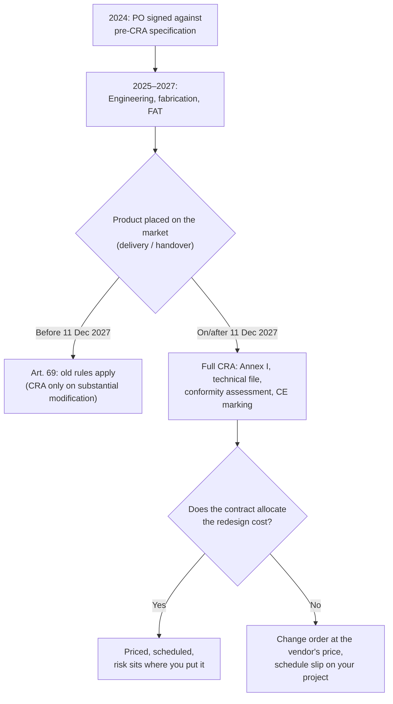

# The 2-Year Lag: Why 2024 Contracts Are Walking into a 2027 Regulatory Trap
*By Jim McKenney — Digital Product Security Consultant, Industrial OT & CRA*

If your procurement contract carries a 2024 specification and a 2028 delivery date, you didn't buy hardware. You bought a multi-million-euro change order, and right now nobody's contract says whose budget it lands in.

That's not a scare line. It's a direct read of two dates in the Cyber Resilience Act — Regulation (EU) 2024/2847 — and the way capital projects handle time. The gap between when you specify equipment and when it shows up on the plant floor is where the money is about to move.

<!-- IMAGE-SLOT: hero | 1200x630 | alt: "A procurement timeline showing a 2024 purchase order and a 2028 delivery date straddling the 11 December 2027 CRA application line" | caption: "The CRA doesn't care when you signed. It cares when the product is first supplied for use in the EU." -->

## The trigger date is "placed on the market" — not your signature

Most of the CRA panic fixates on 11 December 2027. That date is real: under Article 71, the core obligations — secure-by-design essential requirements, technical documentation, conformity assessment, and CE marking — apply from **11 December 2027**. Two earlier dates matter too: the manufacturer reporting duties in Article 14 kick in from **11 September 2026**, and the notified-body machinery (Chapter IV) from 11 June 2026.

But the date that decides your project isn't on that list. It's the phrase *placed on the market*. In EU product law that means the first time a specific product is supplied for distribution or use in the Union — for a bespoke industrial system, that's delivery and handover, not the day you signed the PO.

Article 69 draws the line precisely. Products placed on the market **before** 11 December 2027 stay under the old rules — they're only pulled into the CRA if they undergo a substantial modification after that date. Products placed on the market **on or after** that date get the full regime: Annex I essential requirements, a technical file, conformity assessment, CE marking, a declared support period.

> [!IMPORTANT]
> The grandfather clause runs on the delivery date, not the contract date. A PO you sign in 2024 for a system commissioned in 2028 produces a product placed on the market in 2028 — squarely inside the CRA. The specification is pre-CRA. The delivery is post-CRA. Something has to give, and it isn't the regulation.

## The math nobody put in the tender

Walk the timeline of a normal capital project.

- **2024:** You tender a substation controller, a packaged compressor skid, or a line of PLCs against a technical spec written to today's standards. No SBOM clause. No support-period commitment. No CE-marking-for-cybersecurity requirement, because that requirement didn't exist yet.
- **2025–2027:** Detailed engineering, long-lead fabrication, FAT, shipping, site works.
- **2028:** The vendor delivers and commissions. That is the moment the product is placed on the market.

On that 2028 date, the vendor is legally the manufacturer of a product with digital elements, and they cannot lawfully make it available in the EU without meeting the CRA. The controller you specified in 2024 — the one with no security update mechanism, no documented support period, no technical file — is now non-conforming hardware that can't be CE marked.

The redesign is not optional. The only open question is commercial: **who pays for it, and who eats the schedule slip?** If your contract is silent, you will discover the answer in a variation-order negotiation with all the leverage on the vendor's side, because they can point to a spec you wrote.

## Two traps hiding inside the same gap

**The integrator trap.** If you're an EPC or system integrator combining vendor components into a skid or a plant, read Article 22 carefully. Carry out a *substantial modification* to a product with digital elements and make it available, and the CRA treats **you** as the manufacturer of the modified part — or of the whole product if the change touches its cybersecurity overall. You inherit the technical-file, support-period, and reporting duties for equipment you didn't design. "We just integrated it" is not a defence.

**The retrofit trap.** Grandfathering is not permanent immunity. Substantially modify a pre-2027 product after the cutoff — a firmware architecture change, new connectivity, a security-relevant rework — and it re-enters scope as if new. And one duty reaches back regardless: the manufacturer reporting obligation covers in-scope products placed on the market before 11 December 2027 too. Legacy hardware still generates an obligation the day an actively exploited vulnerability shows up in it.

## Three clauses to fix before your next award

The problem is contractual, so the fix is contractual. None of this requires new engineering today — it requires language in the next agreement you sign.

**1. A delivery-date regulatory clause.** Bind the vendor to the regulatory regime in force *at delivery and placing on the market*, not at tender. State plainly that any product placed on the EU market on or after 11 December 2027 must be delivered CE-marked and CRA-conformant — Annex I essential requirements, a technical file retained for the statutory period, a declared support period, and a machine-readable SBOM — at no additional cost. This closes the "but your spec said…" argument before it starts.

> [!TIP]
> Anchor the obligation to a legal event ("placing on the market within the meaning of Regulation (EU) 2024/2847"), not a calendar date. Projects slip. If your delivery moves from November 2027 to February 2028, a date-based clause can miss; an event-based clause won't.

**2. Explicit risk allocation for the redesign and the slip.** Decide *now* who carries the cost and the schedule if CRA conformity forces a design change — and put liquidated damages behind the schedule commitment. The CRA's own numbers set the backdrop: penalties for breaching the essential requirements reach up to €15,000,000 or 2.5% of worldwide annual turnover. A vendor that under-scoped conformity is exposed; make sure your contract doesn't quietly transfer that exposure to you through a delivery of non-conforming goods you're then stuck operating.

**3. A CRA-readiness questionnaire, scored before award.** Article 5 already requires public buyers to take the CRA's essential requirements into account in procurement — treat that as the floor, not the ceiling, and apply it to every award. Ask each shortlisted vendor, in writing:

- On what date do you expect this product to be *placed on the market*, and will it be CE-marked under the CRA at that point?
- What support period will you declare, and does it cover our expected service life?
- Can you deliver a CycloneDX or SPDX SBOM at handover, and keep it current through the support period?
- What is your vulnerability-handling and coordinated-disclosure process, and your single point of contact for reporting?
- Which conformity assessment route will you use, and — for important or critical products — which notified body?

A vendor who can't answer these hasn't priced the CRA into their bid. That's your redesign, arriving later at their margin.

## Where to take this next

The trap isn't the regulation. The trap is a contract that assumes the rules stand still between signature and delivery. Fix the language and the 2-year lag becomes a scheduling detail instead of a liability.

Do one concrete thing this week: pull your live POs with delivery dates past 11 December 2027 and check each one against the delivery-date clause above. If you want the source text open beside you while you do it, Articles 69 and 71 — plus the procurement duty in Article 5 — are worth reading in full in the [public CRA reading room](/wiki/cra), plain-language and cross-referenced.

Then, when you want to see how a whole portfolio of contracts maps against these dates in one view, [book a walkthrough](/demo). Bring one real purchase order. That's usually where it gets uncomfortable — and useful.

*This is engineering and commercial analysis, not legal advice. Have counsel review contract language before you sign.*
