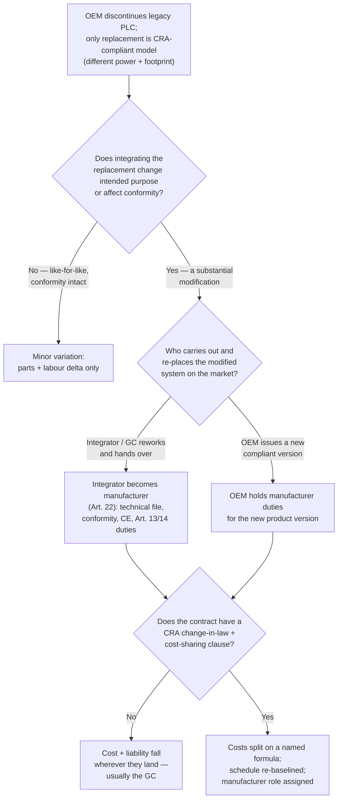

# Variation Orders & Cost Shifts: Who Pays When CRA Forces a Mid-Project Redesign?

*By Jim McKenney — Digital Product Security Consultant & Industrial OT Architect*

<!-- IMAGE-SLOT: hero | 1200x630 | alt: "Control panel with a legacy PLC crossed out and a larger CRA-compliant replacement beside it, engineering change-order paperwork in the foreground" | caption: "A compliant replacement rarely matches the footprint or power budget of the part it retires." -->

Your OEM just sent the notice: the PLC specified in the panel design is going end-of-life, and the only replacement — the CRA-compliant model — draws more current and won't fit the existing footprint. On paper it's a part-number swap. On site it's a redesign: a larger enclosure, a re-sized power supply, a revised thermal budget, fresh EMC work, and a full Factory and Site Acceptance Test re-run. Someone pays for all of it.

The fix is to make sure your contract decided *who* pays before that notice ever arrives.

## The swap that isn't a swap

A like-for-like component substitution is a clerical event. This isn't that. When a replacement PLC changes the power draw and the physical footprint, the change propagates through the whole delivery:

- The enclosure and DIN-rail layout no longer fit — mechanical redesign.
- The 24V supply and distribution are undersized — electrical redesign.
- Heat dissipation shifts — thermal recalculation, possibly forced-air where convection used to be enough.
- The wiring, terminations, and as-built drawings all move — re-documentation.
- Every one of those changes invalidates the last signed-off FAT. You test again.

None of that is exotic. What's new is *why* it's happening. The OEM didn't retire that PLC because the market moved. It retired it because it could no longer place a non-compliant product with digital elements on the EU market and back it for the required support period. The obsolescence is regulatory, and that changes where the cost legitimately lands.

## "Substantial modification" is the phrase that sets your budget

The Cyber Resilience Act — Regulation (EU) 2024/2847, in force since 10 December 2024, with CE-marking obligations applying from 11 December 2027 — turns on one defined term for this scenario.

A **substantial modification** is a change to a product with digital elements, *after* it has been placed on the market, that either affects its compliance with the essential cybersecurity requirements or changes the intended purpose for which it was assessed (Article 3(30)). That is the trigger. Cross it, and the product needs a fresh conformity assessment before it can be handed over.

The half of this that most contracts miss is who becomes the manufacturer once that trigger is crossed. The CRA deems an importer or distributor to be the manufacturer when it substantially modifies a product already on the market (Article 21). Article 22 then reaches one step further: any *other* person — explicitly one other than the manufacturer, importer, or distributor — who carries out a substantial modification and makes the product available on the market is likewise deemed the manufacturer. That is the integrator or general contractor who reworks a supplied system and hands it over as a delivered skid. This is not analogy; it is black-letter text written for exactly this actor. The duties that transfer — technical file, conformity assessment, CE marking, and the Article 13 and 14 reporting obligations — attach to the part you modified, or to the whole product if your change affects its cybersecurity as a whole (Article 22(2)).

> [!IMPORTANT]
> If your team modifies a supplied product enough to affect its conformity, and then hands the result over as part of the works, you may be the manufacturer of that modified product in the eyes of the CRA — not the OEM whose logo is on the box. That is a liability transfer, not just a cost line.

The distinction is not academic. The regulation is explicit that a security update which only lowers cybersecurity risk, without changing the intended purpose, is **not** a substantial modification. A cosmetic or language update isn't either. What tips a change into "substantial" is a broader attack surface, a changed intended purpose, or a change that breaks the basis of the original assessment. A different processor drawing different power, integrated into a re-engineered panel, is exactly the kind of change that can cross that line.

<!-- IMAGE-SLOT: cost-stack | 1200x800 | alt: "Stacked-bar breakdown of redesign cost categories: engineering hours, enclosure and power, thermal and EMC re-test, FAT/SAT re-validation, technical file and SBOM regeneration" | caption: "The variation-order cost stack: re-certification is often the smallest line; the re-validation and re-documentation around it are not." -->

## Where the money actually goes

When people argue about "the cost of the PLC," they anchor on the wrong number. The device delta is trivial next to what surrounds it. The real stack:

1. **Redesign engineering hours** — mechanical, electrical, and controls, plus revised drawings and calculations.
2. **Hardware** — new enclosure, power supply, cooling, cabling, terminations.
3. **Re-test and re-certification** — EMC where the layout changed, and the conformity work itself. Third-party Notified Body assessment for an important product family runs **€20,000–€100,000+**, and that is per product family, not per project.
4. **FAT/SAT re-validation** — the acceptance tests you already passed, run again against the modified system.
5. **Technical file and SBOM regeneration** — the modified product needs its own documentation and software bill of materials, not a copy of the old one.
6. **Schedule** — every item above consumes float, and float that runs out becomes liquidated damages.

A first-pass CRA gap assessment for a mid-sized OEM already lands at **€50,000–€150,000** before any redesign. A mid-project variation of this shape can dwarf that. The question your contract answers — or fails to — is which party carries each line.

## Why force majeure won't catch this

The reflex is to reach for the force majeure clause. It won't hold.

> [!WARNING]
> Force majeure covers events that are unforeseeable *and* unavoidable. A regulation adopted in 2024, in force since December 2024, with a published 11 December 2027 application date, is neither. A tribunal will treat CRA-driven obsolescence as a foreseeable change in law, not an act of god.

Change-in-law is a different contractual animal, and most industrial forms handle it poorly — a vague clause that says the parties will "discuss in good faith." Good faith is not a cost-allocation formula. When the OEM's discontinuation notice lands, good-faith discussion is where the project stalls and the lawyers start billing.

## The decision that actually gets litigated

Here is the flow that determines who pays. Walk it before you sign, not after the notice arrives.

The branch that ends at **H** is the default outcome of a silent contract. Everything below is how you steer to **I**.

## Three instruments to add before the next notice

**1. A CRA change-in-law clause with a real cost-sharing formula.** Name the trigger precisely: a component discontinuation or substitution driven by CRA conformity that rises to a substantial modification. Then state the split — a percentage, a shared-savings mechanism, or a cap per party — plus explicit schedule relief. "Discuss in good faith" is not a formula. A number is.

**2. A ring-fenced FAT/SAT re-validation contingency.** Budget re-validation as a line item with a named trigger, not as a surprise. If a substantial modification forces an acceptance-test re-run, the contingency releases automatically and the schedule re-baselines. This is the line most estimates omit and most disputes are actually about.

**3. An explicit manufacturer-role assignment.** State who holds the CRA manufacturer obligations for the delivered, modified system — the technical file, the conformity assessment, the SBOM, and the Article 13/14 duties. If the integrator will perform the substantial modification, price that responsibility in and put the reporting duties, including the Article 14 reporting obligations that apply from 11 September 2026, where they belong. Leaving it unsaid does not make it disappear; it just decides it badly, later.

## The point

The CRA didn't create component obsolescence — that has always been a project risk. What it changed is the *character* of the risk: the redesign is now driven by law, the liability can transfer with the modification, and the trigger has a legal definition you can write a clause around. Treat a CRA-driven variation like force majeure and you'll absorb it. Treat it like the foreseeable change-in-law event it is, and you'll have priced it before it happens.

If you're negotiating one of these contracts right now, the useful next step isn't more reading — it's watching conformity and technical-file duties trace across a real, modified supply chain before a discontinuation notice forces the conversation on the vendor's terms. [Book a demo](/demo) and walk one of your own live builds through the substantial-modification test.
