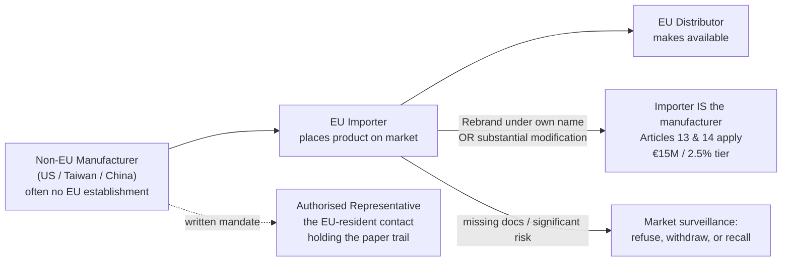

# The Importer's Due Diligence Checklist: Buying Non-EU Hardware Legally

*By Jim McKenney — Digital Product Security Consultant & Industrial OT Architect*

Your supplier in Taiwan, Shenzhen, or Austin has never heard of Regulation (EU) 2024/2847. That is not your problem to fix — but it is entirely your problem to catch. Once their PLC, gateway, or industrial router is placed on the EU market, the market surveillance authority does not fly to Shenzhen. It knocks on the door of the EU economic operator named on the box. That is you, the importer.

The Cyber Resilience Act has been in force since December 2024. CE marking and the core product obligations apply from 11 December 2027; the manufacturer reporting duties start earlier, from 11 September 2026. Most sourcing teams have read that as a manufacturer story. It is not. The CRA writes a distinct, enforceable set of duties for importers, and it hands you a mechanism — buried in a single paragraph — that can quietly move you into the manufacturer's chair, and its fine bracket.

This post is the checklist I run with clients before they sign a purchase order for non-EU hardware with digital elements.

<!-- IMAGE-SLOT: hero | 1200x630 | alt: "A shipping container of industrial hardware at an EU port with a CRA conformity checkpoint overlaid" | caption: "The conformity gate is the port of entry, and the importer's name is on the paperwork." -->

## Why the overseas factory is not the one who pays

The CRA regulates economic operators: manufacturers, importers, distributors. An importer is whoever places a product with digital elements from outside the EU onto the Union market. The logic is jurisdictional, not moral — liability attaches to the party the EU can actually enforce against.

The importer's own duties are set out plainly. You may place on the market **only** products that meet the essential cybersecurity requirements in Annex I, made under a manufacturer process that also meets Annex I. Before the product ships, you must ensure the manufacturer carried out the conformity assessment, drew up the technical documentation, affixed the CE marking, and provided the EU declaration of conformity plus user instructions in a language your destination market understands. If you have reason to believe a product is non-conforming, you must not place it on the market until it is fixed. And you must keep the declaration of conformity — and be able to produce the technical documentation — for at least ten years or the support period, whichever is longer.

> [!NOTE]
> "Ensure" is doing heavy lifting here. It is not "trust the supplier's word." An importer must be *able to provide the documents proving these facts* on a reasoned request from a market surveillance authority. A PDF you have never opened is not evidence.

## The €15M trap: the paragraph that turns an importer into a manufacturer

Here is the part that catches sourcing teams. The CRA says an importer or distributor **is considered to be a manufacturer** — and inherits the manufacturer's full obligations, including drawing up technical documentation and the reporting duties — in two situations:

1. You place the product on the market **under your own name or trademark** (private label, house brand, rebadged skid).
2. You carry out a **substantial modification** of a product already on the market (reflashing firmware, integrating multiple vendors' components into one industrial assembly, changing the security-relevant behaviour).

This is where the money changes. The penalty article sets tiers, and the difference is not cosmetic:

| What you breach | Maximum administrative fine |
|---|---|
| Your own importer duties (verify docs, CE, contact details, record-keeping) | Up to **€10,000,000 or 2% of worldwide annual turnover**, whichever is higher |
| The essential cybersecurity requirements, or the manufacturer's obligations you inherited by rebranding or substantially modifying | Up to **€15,000,000 or 2.5% of worldwide annual turnover**, whichever is higher |

So "the importer becomes the target of the €15M fine" is true, but be precise about the trigger. Ship a non-compliant product and fail your verification duties, and you are exposed at the €10M / 2% tier. Put your logo on it or reflash it, and you have volunteered for the €15M / 2.5% manufacturer tier — because Article 21 now treats you as the maker. The most expensive decision an importer makes is often the marketing decision to private-label.

<!-- IMAGE-SLOT: liability-chain | 1200x675 | alt: "Diagram of the CRA liability chain from non-EU manufacturer through importer to distributor" | caption: "Liability follows enforceability. Rebrand or modify, and the importer node absorbs the manufacturer's obligations." -->

## The authorised representative: your best contractual leverage

A non-EU manufacturer with no EU establishment can appoint an EU-based authorised representative by written mandate. That representative keeps the declaration of conformity and technical documentation available to authorities for the ten-year window and cooperates on any action to remove risk. What the mandate cannot outsource is the manufacturer's design and conformity-assessment work itself — the representative holds the paper, not the responsibility for the engineering.

For you as importer, insisting the OEM appoint an authorised representative does two things: it creates an EU-resident party who is contractually obligated to hold the documentation you will one day need to produce, and it flushes out non-EU suppliers who have no intention of doing the compliance work at all. A supplier who refuses to name an authorised representative is telling you the technical file does not exist.

## The 10-point importer due-diligence checklist

Run this before you place a purchase order, not after the container is at anchor. Every item maps to a document you must be able to hand a market surveillance authority.

1. **Scope and class the product.** Is it a product with digital elements at all? Is it default-category, an Important product (Annex III), or a Critical product (Annex IV)? The class determines whether a third-party conformity assessment by a notified body was mandatory. Self-assessed where a notified body was required is an automatic non-conformity.
2. **Obtain the EU Declaration of Conformity and read it.** It must name Regulation (EU) 2024/2847, identify the exact product and manufacturer, and — for Important/Critical products — cite the notified body's identification number. A DoC that references only the RED or the Machinery Regulation does not cover the CRA.
3. **Verify the CE marking physically.** Confirm it is affixed to the product, its packaging, or accompanying documents — not merely asserted in an email. Photograph it at incoming inspection.
4. **Secure the technical documentation, or an enforceable right to it.** You must be able to produce it for ten years or the support period. If the OEM will not hand over the full file, get a contractual, escrow-backed right to obtain it (see below).
5. **Demand a machine-readable SBOM.** A CycloneDX or SPDX bill of materials that matches the exact firmware build you are importing. No SBOM means the manufacturer cannot meet Annex I vulnerability-handling requirements, which means the product is not conforming.
6. **Confirm the coordinated vulnerability disclosure contact and support period.** You inherit the duty to relay vulnerabilities to the manufacturer without undue delay. If you cannot reach them, you cannot discharge that duty.
7. **Check user information and security instructions (Annex II).** Present, complete, and in the language of every destination member state.
8. **Confirm a reachable EU point of contact exists.** Either an EU-established manufacturer, a named authorised representative, or — by default — you. Non-EU hardware with no EU-resident responsible party cannot be lawfully placed on the market.
9. **Affix your own importer identity.** Your name, registered trade name or trademark, postal address, and an electronic contact, on the product, packaging, or accompanying document. This is a hard obligation, not branding.
10. **Screen your own process for the Article 21 trap.** Are you private-labelling? Reflashing firmware? Assembling multi-vendor components into one deliverable? Any "yes" means you are the manufacturer — stop and re-scope your obligations before you ship.

> [!TIP]
> Turn this list into a gated incoming-inspection procedure. No line item cleared, no goods placed on the market. The cost of a failed gate is a delayed shipment. The cost of a skipped gate is a recall and a fine measured against worldwide turnover.

## Technical-documentation escrow: the clause for the day the OEM goes dark

The CRA anticipates the overseas factory disappearing. If you learn the manufacturer has ceased operations and can no longer meet its obligations, the duty to inform authorities — and, as far as possible, users — falls to you. You cannot discharge a ten-year documentation obligation with a supplier who no longer exists.

The mechanism is a technical-documentation escrow. Contractually require the OEM to deposit the complete technical file — Annex VII documentation, the SBOM, the signed declaration of conformity, and where relevant the firmware and signing artefacts — with a neutral escrow agent, released on insolvency, cessation, or a defined support-period breach. This is the same pattern software buyers have used for source-code escrow for decades, applied to conformity evidence. It is the difference between a supplier bankruptcy being their problem and being your ten-year liability.

## Customs-clearance readiness

Market surveillance under Regulation (EU) 2019/1020 gives authorities the power to check products at the border and, where a product presents a significant cybersecurity risk, to suspend its release, refuse it, or order withdrawal or recall. Keep the declaration of conformity and your importer contact details in the customs file itself, not in a folder on someone's laptop. A clean paper trail at the port is what turns an inspection into a formality instead of an impoundment.

> [!WARNING]
> There is a real gap you cannot close yet. No CRA harmonized standards have been published in the Official Journal — the presumption of conformity route is not yet available. Until it is, the defensible baseline for industrial hardware is IEC 62443: the 4-1 secure-development-lifecycle process and the 4-2 component requirements, mapped against Annex I. Buy from suppliers who can already speak that language, and document the mapping now.

## What to do this week

Pull your active non-EU hardware suppliers into a single list. For each, mark whether you private-label it, whether you modify it, and whether you hold a declaration of conformity and an SBOM today. The ones where all three answers are wrong are your Article 21 exposure — the products where you are already, quietly, the manufacturer.

Then run that list against the checklist for real, not on paper. The conformity workspace scores a supplier package against these ten gates in one pass — [take the tour](/tour) to see it applied across a portfolio, or [book a demo](/demo) to put one of your own non-EU lines through it and find out where you're already the manufacturer.
