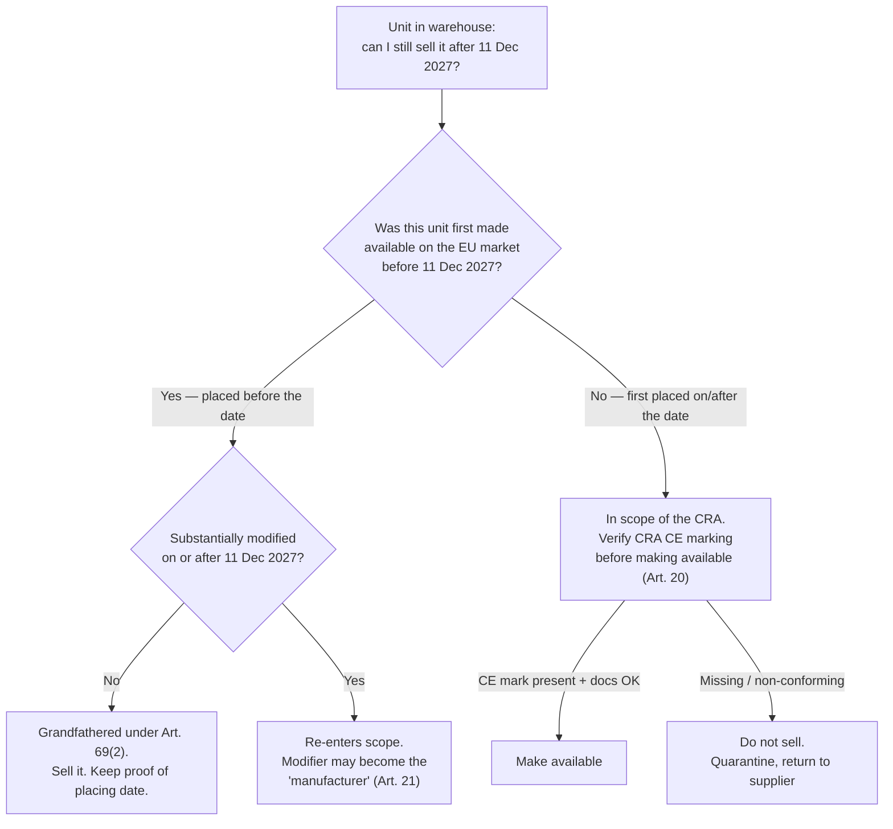

# Distributor Gatekeeping: What Stock Must Be Purged Before December 2027?

*By Jim McKenney — Digital Product Security Consultant & Industrial OT Architect*

Nothing in the Cyber Resilience Act turns your warehouse into scrap on 11 December 2027. If a wholesaler has been told to "purge legacy stock before the deadline or eat the write-down," someone has misread the transitional rule — and it is an expensive misread. The date that decides whether a unit is still legal to sell is the date it was **placed on the market**, and that is a per-unit event that mostly happened long before it reached your shelf.

Get this one concept right and the panic disappears. Get it wrong and you either dump sellable inventory or, worse, ship non-conforming product past a gate you were legally required to hold.

<!-- IMAGE-SLOT: hero | 1200x630 | alt: "Automation distributor warehouse aisle with a compliance checkpoint overlay separating grandfathered stock from post-deadline stock" | caption: "The line that matters runs through each pallet's placing date — not through 11 December 2027." -->

## The rule everyone gets backwards: "placing on the market" is per-unit

The CRA (Regulation (EU) 2024/2847) defines **placing on the market** as *"the first making available of a product with digital elements on the Union market."* **Making available** is any supply for distribution or use in a commercial activity. Two consequences fall straight out of those definitions:

- A product is placed on the market **once** — the first time that specific unit is supplied into the EU. The essential cybersecurity requirements attach to *each individual product* at its placing. This is not type approval. Every unit has its own placing event.
- A **distributor** — defined as anyone in the supply chain other than the manufacturer or importer who makes a product available *without affecting its properties* — does not "place" product on the market. The manufacturer or the importer does that when they first supply it into the Union. You **make it available** further down the chain.

So the stock already sitting in your racks was, in almost every case, placed on the market when your supplier first delivered it into the EU — typically well before you sold it on. That timing is what the transitional rule keys on.

> [!IMPORTANT]
> If you import directly from outside the EU, you are the **importer**, not just a distributor. In that case *you* place the product on the market, and the placing date is when you first make it available. Your grandfathering position depends on the role you actually play per SKU, not on the sign over the door.

## Can you still sell legacy hardware after the deadline? Yes — read Article 69(2)

The transitional provision is short and decisive. Products placed on the market **before 11 December 2027** are subject to the CRA's requirements *only if, from that date, they undergo a substantial modification*. Units already in the Union market before the deadline are not retroactively pulled into scope. They keep their legal status. You can keep selling them.

That is the opposite of a cliff. It is a grandfather clause. What matters is provable placing date per unit, not the calendar date you happen to ship it to a customer.

The trap in that flow is **substantial modification**: a change after placing that affects compliance with the essential requirements or changes the product's intended purpose. Reflashing firmware, re-badging, bundling a grandfathered controller into a new configured assembly — any of these can qualify. Do it, and the unit re-enters scope; the party making the modification can then inherit the manufacturer's obligations. Depleting old stock as-is is fine. "Refurbishing" it is where distributors walk into liability.

## The part that *is* retroactive: incident and vulnerability reporting

One obligation reaches back over grandfathered stock. The Article 14 reporting duties apply to **all** in-scope products placed on the market before 11 December 2027, and that reporting regime starts on **11 September 2026**. Article 14 sits on the manufacturer, but the distributor's gatekeeping duty gives you a live role too: on becoming aware of a vulnerability in a product you have made available, you must inform the manufacturer without undue delay, and where the product presents a significant cybersecurity risk, inform the market surveillance authorities in the Member States where you sold it. Selling grandfathered hardware does not switch off your reporting reflex.

## What Article 20 actually puts on you from day one

From 11 December 2027, before you make an in-scope product available, Article 20 requires you to verify — as a gatekeeper — that:

- the product **bears the CE marking**; and
- the manufacturer and importer have met their specified obligations (documentation, contact details, instructions to the user) and handed you the documents you need.

If you have reason to believe a product or the manufacturer's processes are not in conformity, you must **not** make it available until it is brought into conformity. This is the real weight of "distributor gatekeeping": for stock placed after the deadline, you are the checkpoint, and shipping a non-conforming unit past that checkpoint is your breach, not only the manufacturer's.

## The warehouse stock audit checklist

Run this per SKU, not per brand. The goal is a defensible placing-date position for everything in scope.

- [ ] **Identify in-scope SKUs.** Flag every product with digital elements — anything with software, firmware, or a logical/physical/indirect network connection. Passive mechanical parts are out; connected controllers, gateways, IIoT sensors, managed switches, HMIs are in.
- [ ] **Establish the placing date per lot.** Pull the earliest evidence each lot was first made available in the EU: supplier delivery date into the Union, first EU commercial invoice, customs entry for your own imports.
- [ ] **Split the inventory.** Two bins: *placed before 11 Dec 2027* (grandfathered) and *first placed on/after* (must carry CRA CE marking).
- [ ] **Confirm your role per SKU.** Distributor or importer? Direct-import lines change who owns the placing event and the conformity checks.
- [ ] **Check the CE-marking gate on post-deadline stock.** For anything placed after the date, confirm CE marking and that the required manufacturer/importer documents are present before you make it available.
- [ ] **Freeze modification workflows.** Any kitting, firmware update, or re-badging on grandfathered stock is a substantial-modification risk. Route those SKUs through a review before touching them.
- [ ] **Map suppliers who may not survive to the deadline.** If a manufacturer folds, your gatekeeping duty obliges you to notify market surveillance authorities and, as far as possible, users of affected stock.

<!-- IMAGE-SLOT: inline-decision | 1200x675 | alt: "Two-bin inventory split diagram: grandfathered stock placed before 11 December 2027 versus post-deadline stock requiring CRA CE marking" | caption: "One audit, two bins: provable pre-deadline placement on one side, CE-marking gate on the other." -->

## Proof-of-placement documentation: the asset that keeps stock sellable

Grandfathering is worthless if you cannot evidence it. A market surveillance authority can issue a reasoned request, and your gatekeeping duty requires you to produce the documentation demonstrating conformity — including, in practice, the placing date. Build a proof-of-placement pack per lot and keep it retrievable:

- **Placing-date evidence:** first EU supply/delivery record, dated commercial invoice, or customs import record showing the unit entered the Union market before 11 December 2027.
- **Lot/serial linkage:** batch or serial ranges tying the physical stock to that dated record, so a shelf unit maps to its placing event.
- **Supplier attestation:** a statement from the manufacturer or importer confirming first placing on the EU market before the deadline for the identified lots.
- **Role record:** documentation of whether you acted as distributor or importer for that line.
- **Change log:** a record showing the unit has *not* been substantially modified since placing.

> [!TIP]
> Run this as first-in-first-out with intent. Sell down grandfathered, well-documented stock first, and let post-deadline inventory arrive already CE-marked under the CRA. FIFO here is not just working capital hygiene — it shrinks the pile of units whose placing date you have to defend.

## The penalty reality — and a number worth correcting

Distributor obligations under Article 20 fall in the CRA's **middle** penalty tier: up to **€10,000,000 or 2% of total worldwide annual turnover**, whichever is higher. The headline €15,000,000 / 2.5% figure applies to breaches of the essential cybersecurity requirements and the manufacturer's core duties — not to distributor gatekeeping failures. Still material, and worth naming precisely, because "€15M or 2.5%" gets copy-pasted onto every CRA slide regardless of who it actually binds.

The commercial exposure is more immediate than the fine. Dump grandfathered stock you could have sold, and you eat the write-down for nothing. Ship a post-deadline unit without the CE-marking check, and you own the non-compliance. Both failures trace back to the same missing artifact: a per-unit placing-date record you can produce on request.

Work the placing date, not the calendar. That is the whole discipline.

Before you touch a single pallet, read the one thing that governs all of it: the transitional provision itself. The exact text of Article 69(2) and the distributor duties sits in the [interactive CRA wiki](/wiki/cra) — read it once, then build your proof-of-placement pack against what it actually says, not against the deadline panic doing the rounds.
