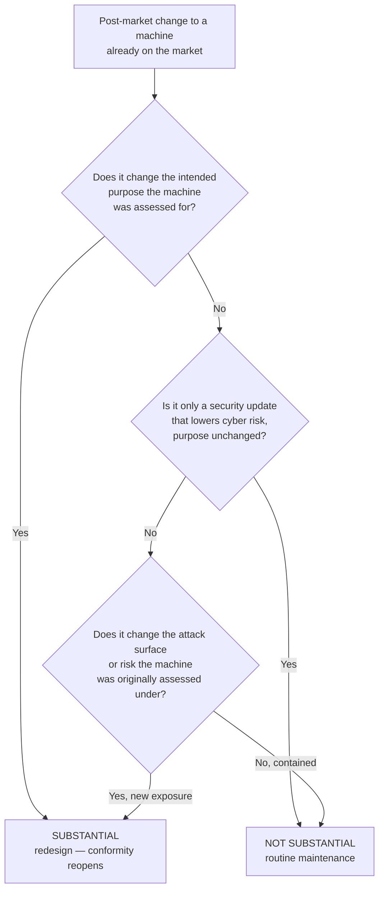

# When Maintenance Becomes Redesign: The Test for Brownfield Retrofits

*By Jim McKenney — Digital Product Security Consultant & Industrial OT Architect*

Your 2005 packaging line is not covered by the Cyber Resilience Act. It was placed on the market twenty-two years before the Regulation's product obligations bite, and Article 69(2) is unusually blunt about it: a product already on the market before 11 December 2027 falls under the CRA only if, from that date, it is **substantially modified**. So the machine on your floor sits outside the Regulation — right up until the afternoon a technician bolts a cellular gateway onto it for remote diagnostics.

Whether that afternoon drags the whole line into scope turns on one question, and it is not "did you add connectivity?" It is "was the change substantial?" Those are different questions, and confusing them is where the panic starts.

<!-- IMAGE-SLOT: hero | 1200x630 | alt: "A weathered early-2000s packaging line on a factory floor with a small modern cellular gateway enclosure freshly bolted to its control cabinet" | caption: "The machine is out of CRA scope by age. The gateway is what puts that in play — but only if the change is substantial." -->

You have probably heard the blunt version of the fear: add a €500 gateway to a twenty-year-old machine and you trigger a full CE re-certification of the whole line. As stated, that is wrong. A modification reopens conformity only when it meets the statutory definition of substantial, and plenty of connectivity retrofits never come close. The real work is knowing which side of the line yours lands on — and, better, engineering it to land where you want.

## Two limbs, and either one is enough

This is not a judgement call. Article 3(30) defines a substantial modification as a change to a product after it is placed on the market that either:

- **affects the product's compliance** with the essential cybersecurity requirements in Annex I, Part I; **or**
- **results in a modification to the intended purpose** for which the product was assessed.

Either limb, on its own, is enough. Recital 38 sharpens the first: a physical or digital change *not foreseen by the manufacturer in the initial risk assessment*, which may mean the product no longer meets those requirements. Recital 39 carves out the obvious exception in the other direction — a security update that lowers cyber risk without changing the intended purpose is explicitly **not** substantial. Patching the machine to keep it safe is the thing the CRA wants you to do; it is not the thing that turns you into a manufacturer.

So the definition is a short sequence of gates. Run your retrofit through them in order.

## Walking the packaging line through the gates

**Gate 1 — intended purpose.** A line that cartons and palletizes still cartons and palletizes after you hang a diagnostic tap off it; the purpose the machine was assessed for is unchanged. But if the gateway lets a remote operator start, stop, or reconfigure the line from a laptop, you have added a control function that was never part of the assessed purpose. That is the second limb, and it is decided before you even reach the cybersecurity question.

**Gate 2 — the security-update carve-out.** Adding a gateway is not a security update, so this gate rarely rescues a connectivity retrofit. It matters for the opposite reason: it stops you from over-reporting. Pushing a firmware patch that closes a known vulnerability, with the machine doing exactly what it did before, is maintenance — do not dress it up as a redesign and manufacture paperwork you do not owe.

**Gate 3 — the assessed risk.** Here is where most gateway retrofits actually cross. The original risk assessment for that 2005 line assumed an isolated control network with no route in from the outside world. A cellular modem with a reachable path into the PLC is a new, internet-facing attack vector that assessment never contemplated. The machine's compliance posture — the set of assumptions Annex I conformity would rest on — has changed. First limb, satisfied. Substantial.

Notice what Gates 1 and 3 have in common: both turn on whether you changed *what the machine is for* or *the risk it was assessed under*. Leave both untouched and neither limb fires.

## How you add the gateway decides the answer

This is the part that is actually in your hands, and it is the whole reason to run the test *before* the retrofit rather than after a market-surveillance letter.

The same cellular gateway can land on either side of the line depending on how you wire it:

- **One-way, not two-way.** A read-only telemetry tap that mirrors sensor and counter data *outbound* — with no reachable path back into control logic — does not hand a remote attacker any control the machine never exposed. A bidirectional remote-access channel to the HMI does exactly that, and changes the assessed risk in the process.
- **Segment it.** Put the gateway in its own zone and conduit, in IEC 62443 terms — firewalled or data-diode one-way — so the PLC's attack surface stays identical to what was originally assessed. If the control network a threat actor can reach is unchanged, Gate 3's honest answer is "contained."
- **Buy conformity, don't build it.** The gateway is itself a product with digital elements. Source a CRA-compliant one placed on the market after 2027 and its conformity is the gateway manufacturer's problem, not yours — you are integrating a conforming component, not redesigning the line.

Do it this way and the truthful answer at Gate 3 is that the assessed posture still holds: routine maintenance, machine stays out of scope. Wire the modem straight onto the control VLAN with a remote-desktop path to the HMI and the truthful answer is "substantial" — you have rebuilt the machine's risk profile, and the definition follows you home.

<!-- IMAGE-SLOT: two-wirings | 1200x675 | alt: "Side-by-side wiring diagram: left, a segmented one-way telemetry tap isolated behind a data diode staying on the maintenance side; right, a two-way gateway on the control VLAN with a path to the HMI crossing into substantial modification" | caption: "Same gateway, two wirings. Containment keeps Gate 3 answered 'no'; a two-way path into control logic answers it 'yes'." -->

## If it is substantial, whose name is on it?

Cross the line and someone is deemed the manufacturer of the modified product — inheriting the manufacturer duties: the technical documentation, the conformity assessment, the CE marking, the reporting obligations. Which provision does the deeming depends on who *you* are.

If you are a plant operator or an integrator who is neither the manufacturer, the importer, nor the distributor of that machine, and you carry out the substantial modification and make the product available on the market, **Article 22** deems you the manufacturer — for the part affected, or for the whole machine if the change hits its cybersecurity as a whole. If instead you are the importer or distributor of that same machine — you bought it directly from a non-EU builder, say — the deeming runs through **Article 21** rather than 22. Same trigger, different door, decided entirely by your existing role.

One caveat worth stating plainly: both provisions turn on *making the product available on the market*. A retrofit you perform on your own line, for your own use, that never leaves your ownership is a different situation from re-selling a modified machine. But the moment that asset changes hands — a plant sale, a line relocated to another legal entity, a machine sold on second-hand — its modification history is precisely what a buyer's due diligence will test. The exposure does not vanish; it waits.

## The record that proves you ran the test

A test you cannot show is worth nothing. For every connectivity or capability retrofit, the maintenance log should carry four lines: the date and description of the change; which limb of the definition you evaluated; the containment decision and *why* it leaves intended purpose and assessed risk unchanged; and the engineer's sign-off. That record is the entire distance between "we assessed this and it stayed maintenance" and "we hoped nobody would ask."

The CRA already expects operators to trace, for ten years, who supplied and received a product (Article 23). Extend the same discipline one column to the right — who *modified* it, and how — and you have the contemporaneous evidence that turns a nervous conversation with an auditor into a short one.

Pick the single retrofit on your floor you are least sure about: the oldest machine that got the newest connectivity. Run it through the three gates this week. If it clears them because you contained the change, write that down while the reasoning is fresh. If it does not, your name is already on a technical file you have not built yet — and the sooner you know that, the cheaper it is to fix. To watch that modification test — and the technical file it feeds — run against a real product, [take the 90-second platform tour](/tour).
