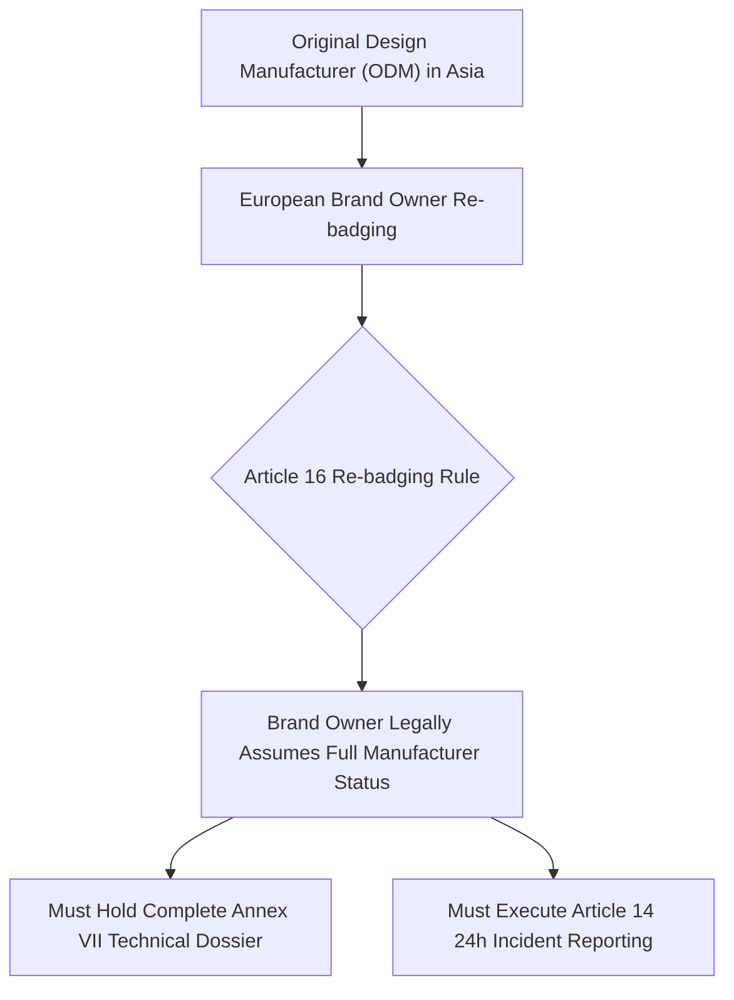

# White-Label Hardware & ODM Contracts: Shifting the CE Nameplate Burden
*By Jim Mckenney — Digital Product Security Consultant & Industrial OT Architect*

> **Executive Technical Memorandum:**
> - **Statutory Scope:** `Article 16, Article 28`
> - **Primary Persona:** `ODM Manufacturers, Hardware Importers, Private-Label Automation Brands.` (`EPC & Integrators`)
> - **Curriculum Track:** `Tier-2 Upstream Component Supplier Survival` (Track 4)
> - **Regulatory Complexity:** `Advanced Engineering` • **Key Exposure:** `Article 16 Exposure`
> - **Companion Audio Briefing:** [EP_4.05 - Audio Broadcast (14:15)](https://oxot.ai/podcast) | [Standard Series RSS](https://oxot.ai/feeds/cra-podcast.xml)

---

## 1. The Commercial Dilemma & Industrial Reality

`[EP_4.05 - Strategic Technical Briefing] White-Label Hardware & ODM Contracts: Shifting the CE Nameplate Burden | Jim Mckenney`

**The Core Industry Problem:** An Asian ODM builds hardware branded under an EU automation label. Who is the legal manufacturer, and who must maintain the technical file for 10 years?

> *"*"If your brand is on the box, the EU market surveillance authorities don't care who soldered the chips in Shenzhen."*"*

In industrial engineering and critical infrastructure operations, the arrival of **Regulation (EU) 2024/2847 (Cyber Resilience Act)** shatters historical procurement and maintenance assumptions. Stakeholders must recognize that commercial contracts, variation orders, and legacy supply chain models can no longer disclaim statutory cybersecurity conformity.

Under **Article 16, Article 28**, equipment placed on the European Single Market must satisfy mandatory cybersecurity baselines, maintain cryptographic technical files, and adhere to strict zero-day vulnerability notification timelines.

---

## 2. Key Strategic & Engineering Takeaways

1. **ODM master service agreements**
2. **technical file deposit escrow**
3. **audit right provisions**

---

## 3. Reference Architecture & Technical Implementation

The following domain-specific architecture illustrates the compliant engineering workflow, safe-harbor isolation boundary, and regulatory decision gate for `EP_4.05`:

---

## 4. Mandatory 4-Step Engineering Action Sprint

To ensure defensible compliance with **Article 16, Article 28**, organizations must execute the following structured remediation sprint:

1. **Conduct Asset & Contract Scope Audit:** Inventory all active hardware variants, firmware repositories, and supplier agreements across the operational footprint.
2. **Embed Statutory Safe-Harbor Clauses:** Insert CRA bilateral compliance warranties and 10-year technical dossier retention terms into upstream supplier and EPC subcontracts.
3. **Automate CycloneDX v1.6 SBOM Vaulting:** Implement automated CI/CD bill of materials generation with cryptographic code signing stored in an immutable 10-year archive.
4. **Operationalize Article 14 24h CSIRT Notification:** Conduct simulated drills for reporting actively exploited zero-days to the ENISA Single Reporting Platform within the mandatory 24-hour statutory window.

---

## 5. Statutory Cross-References & Legal Text

- **EU Cyber Resilience Act:** [Read Article 16, Article 28 in the Interactive CRA Legal Wiki](http://localhost:8088/conformity/cra-wiki?tab=articles&num=16)
- **Audio Intelligence Platform:** [Listen to the Full Audio Episode](https://oxot.ai/podcast)
- **Technical Consultation:** [Schedule an Architecture Review with OXOT Advisory](http://localhost:8088/contact)
