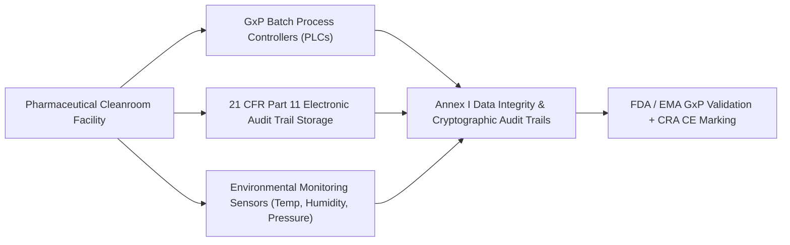

# Pharmaceutical & Process Manufacturing: GxP, 21 CFR Part 11 & Cleanroom Automation
*By Jim Mckenney — Digital Product Security Consultant & Industrial OT Architect*

> **Executive Technical Memorandum:**
> - **Statutory Scope:** `Annex I Part I`
> - **Primary Persona:** `Pharma Automation Directors, GxP Validation Engineers, Bioreactor System Integrators.` (`EPC & Integrators`)
> - **Curriculum Track:** `Critical Sector Deep Dives` (Track 5)
> - **Regulatory Complexity:** `Executive Policy` • **Key Exposure:** `Article Annex I Part I Exposure`
> - **Companion Audio Briefing:** [EP_5.07 - Audio Broadcast (14:15)](https://oxot.ai/podcast) | [Standard Series RSS](https://oxot.ai/feeds/cra-podcast.xml)

---

## 1. The Commercial Dilemma & Industrial Reality

`[EP_5.07 - Strategic Technical Briefing] Pharmaceutical & Process Manufacturing: GxP, 21 CFR Part 11 & Cleanroom Automation | Jim Mckenney`

**The Core Industry Problem:** In pharma, any software change requires exhaustive GxP computer system validation (CSV). How do pharma manufacturers apply CRA security patches without halting drug production?

> *"*"Applying a security patch to an automated vaccine batch reactor can trigger a 6-month GxP re-validation nightmare. Here is the cure."*"*

In industrial engineering and critical infrastructure operations, the arrival of **Regulation (EU) 2024/2847 (Cyber Resilience Act)** shatters historical procurement and maintenance assumptions. Stakeholders must recognize that commercial contracts, variation orders, and legacy supply chain models can no longer disclaim statutory cybersecurity conformity.

Under **Annex I Part I**, equipment placed on the European Single Market must satisfy mandatory cybersecurity baselines, maintain cryptographic technical files, and adhere to strict zero-day vulnerability notification timelines.

---

## 2. Key Strategic & Engineering Takeaways

1. **Risk-based GxP patching protocols**
2. **automated validation test scripts**
3. **audit-trail integrity under CRA**

---

## 3. Reference Architecture & Technical Implementation

The following domain-specific architecture illustrates the compliant engineering workflow, safe-harbor isolation boundary, and regulatory decision gate for `EP_5.07`:

---

## 4. Mandatory 4-Step Engineering Action Sprint

To ensure defensible compliance with **Annex I Part I**, organizations must execute the following structured remediation sprint:

1. **Conduct Asset & Contract Scope Audit:** Inventory all active hardware variants, firmware repositories, and supplier agreements across the operational footprint.
2. **Embed Statutory Safe-Harbor Clauses:** Insert CRA bilateral compliance warranties and 10-year technical dossier retention terms into upstream supplier and EPC subcontracts.
3. **Automate CycloneDX v1.6 SBOM Vaulting:** Implement automated CI/CD bill of materials generation with cryptographic code signing stored in an immutable 10-year archive.
4. **Operationalize Article 14 24h CSIRT Notification:** Conduct simulated drills for reporting actively exploited zero-days to the ENISA Single Reporting Platform within the mandatory 24-hour statutory window.

---

## 5. Statutory Cross-References & Legal Text

- **EU Cyber Resilience Act:** [Read Annex I Part I in the Interactive CRA Legal Wiki](http://localhost:8088/conformity/cra-wiki?tab=articles&num=Annex I Part I)
- **Audio Intelligence Platform:** [Listen to the Full Audio Episode](https://oxot.ai/podcast)
- **Technical Consultation:** [Schedule an Architecture Review with OXOT Advisory](http://localhost:8088/contact)
