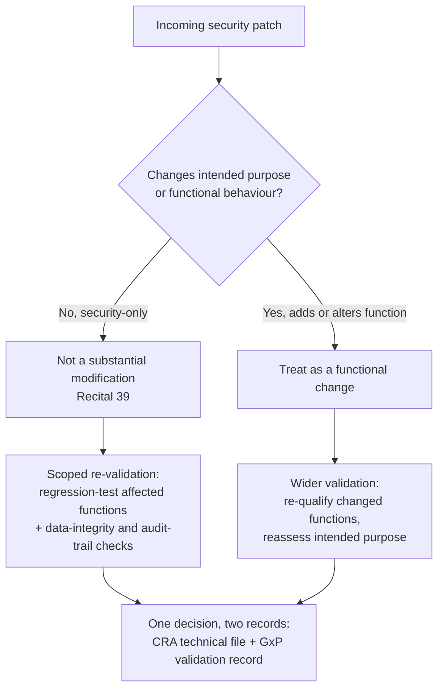

# Patching Validated Pharma Systems: Security Updates Without a Full CSV Re-Run
*By Jim McKenney — Digital Product Security Consultant & Industrial OT Architect*

Two software rulebooks now meet on the same process controller, and at first read they give opposite orders. The Cyber Resilience Act tells a pharma manufacturer to remediate a known vulnerability without delay and ship the security update. Decades of computer-system-validation (CSV) practice tell the same manufacturer that any change to validated software reopens the qualification. Put side by side, they look like a trap: patch fast and you break validated state, hold the patch and you sit on a known-exploitable hole in a controller that runs live product. The trap is mostly imaginary. The CRA's security baseline is explicitly risk-based, and so is modern validation. Once that clicks, the question stops being "patch or validate" and becomes "scope the re-validation to what the patch actually changed."

<!-- IMAGE-SLOT: ep-5.07-hero | 1200x630 | alt: "A bioreactor process skid and control cabinet in a pharmaceutical cleanroom, with a maintenance tablet showing a software update in progress." | caption: "A validated process controller can take a security patch without a full re-qualification — if the change is classified and evidenced." -->

## Two clocks on one bioreactor controller

The controllers under discussion are ordinary process automation: fed-batch bioreactor PLCs, cleanroom HVAC and pressure-cascade automation, fill-finish line logic, environmental monitoring systems. They run validated software, and under the CRA they are now also products with digital elements carrying vulnerability-handling duties. Annex I Part II requires the manufacturer to address and remediate vulnerabilities without delay by providing security updates, and, where technically feasible, to provide those security updates *separately from functionality updates*. That last clause is the one that saves you, and I'll come back to it.

The opposing clock is procedural, not statutory. CSV convention treats every code change as a deviation that reopens installation, operational, and performance qualification. Applied literally to a security patch, it converts a two-hour library swap into a two-quarter re-qualification campaign, which is exactly why so many validated plants quietly stop patching.

> [!NOTE]
> **What is CRA and what is not.** Only the Cyber Resilience Act, Regulation (EU) 2024/2847, is EU product law in play here. GAMP 5 is ISPE guidance, not law. EU GMP Annex 11 and US FDA **21 CFR Part 11** are separate frameworks governing computerised systems and electronic records; Part 11 is US law and has no CRA authority at all. They matter operationally, but do not present any of them as a CRA obligation. The CRA argument below stands on its own text.

## It is a CRA product, and it is not a medical device

Before scoping anything, kill the exemption argument someone will inevitably raise. The CRA does not apply to products covered by the Medical Devices Regulation (2017/745) or the In Vitro Diagnostic Regulation (2017/746); that carve-out sits in Article 2. It does not reach your process line. A bioreactor that manufactures a drug substance is not itself placed on the market as a medical device. The drug is regulated as a medicinal product, the controller is not a medical device, and the medical-device exclusion never attaches to it. Your process automation is a product with digital elements in full CRA scope. Plan for the duty rather than hunting for a way out of it.

## The hinge: a pure security update is not a substantial modification

One provision makes scoped re-validation legally defensible: the definition of what counts as a *substantial* modification. Under Article 3(30), a substantial modification is a post-market change that either affects the product's compliance with the essential requirements or modifies the intended purpose for which it was assessed. Recital 39 then draws the line precisely: a security update designed to decrease cybersecurity risk, which does not modify the intended purpose, is *not* a substantial modification. The recital spells out the common case, a fix for a known vulnerability made through minor source-code adjustments, and calls it exactly what it is: not substantial.

Now recall the Annex I Part II instruction to keep security updates separate from functionality updates. Read the two together and the method appears on its own. If you hold the fix clean of new features, the CRA itself declares that you have not substantially modified the product. No new conformity assessment, no re-issued declaration of conformity. The boundary between a security-only patch and a feature change is the same boundary that decides how much validation you owe. (For the full substantial-modification test, see [When Maintenance Becomes Redesign](/blog/ep-3.02-when-maintenance-becomes-redesign-the-4-step-test-).)

## The classification gate

The whole method turns on one question, asked in writing before anyone touches the controller: does this patch change *what* the system does, or only *how safely* it does it?

Most CRA-driven patches land on the left branch. A crypto library update, an OS security fix, a protocol-stack hardening: none of these change a batch recipe, a setpoint, or an operator workflow. The right branch is for the patch that also ships a feature, and the fix for that is to unbundle it. Take the security change now on the left branch, and route the functional change through your normal change control.

<!-- IMAGE-SLOT: ep-5.07-scoped-validation | 1200x675 | alt: "A system diagram in which one patched component is ringed, and only the directly connected functions are marked for re-validation while the rest of the validated system stays untouched." | caption: "Scope the re-validation to the blast radius of the patch, not the whole plant." -->

## The scoped re-validation protocol

This is the part your quality unit can operationalise. Five steps, each producing evidence that serves both regimes at once.

1. **Classify the change first, in writing.** Before the patch reaches the controller, record security-only versus functional and the reasoning behind it. That single classification is what tells a GMP inspector and a market surveillance authority which path you took and why.
2. **Update the cybersecurity risk assessment; do not restart it.** Article 13(2) and 13(3) already require a documented risk assessment that you keep current across the support period. Feed the patch into the existing assessment: what the vulnerability exposed, what the fix alters, what residual risk remains. This CRA artifact doubles as your validation rationale.
3. **Scope validation to the blast radius, not the plant.** A risk-based approach lets you re-test the functions the patch touches plus the data-integrity and audit-trail paths, instead of re-qualifying the whole system. A TLS fix in the HMI does not reopen the qualification of the batch recipe engine, and you should be able to say why on paper.
4. **Run automated validation scripts for the affected cases.** Pre-authored, version-controlled regression scripts turn "re-verify the affected functions" from a manual campaign into a controlled test run measured in hours. Keep the scripts themselves under change control so the evidence is as trustworthy as the result.
5. **Write one change into two records.** Cross-reference the CRA technical documentation with the GxP validation record, so both an inspector and a surveillance authority see the same decision, the same test evidence, and the same proof that the audit trail survived intact.

## Worked example: an OpenSSL CVE in the SCADA layer

A critical CVE lands in the OpenSSL build inside the SCADA layer of a fed-batch bioreactor controller. Classify it: the patch replaces a vulnerable crypto library and changes no recipe logic, no setpoints, no operator workflow. Intended purpose unchanged, so under Recital 39 it is not a substantial modification. Update the risk assessment to record the exposure and the fix. Scope the validation: confirm the batch recipe still executes end to end, confirm the electronic audit trail still records operator actions with intact timestamps and signatures, and run the automated regression suite against the affected communication paths. Document both records and cross-reference them. That is a few days of scoped, evidenced work, not a two-quarter re-qualification of the entire line, and at the end you can prove the reactor is both patched and still validated.

## The reframe

The instinct to protect validated state is correct. The mistake is treating re-validation as the thing to avoid. Re-validation is not the enemy. The un-assessed change is. The team that gets hurt in an inspection is not the one that re-qualified a patched function. It is the one that pushed a silent patch with no classification, no risk-assessment entry, and no test evidence, and then could not answer the only question that ever gets asked: what did this change touch, and how do you know it still works. Scope the re-validation to the change, document it once for both regimes, and a known-exploitable hole in a validated reactor closes in days without anyone pretending the change never happened. The validation was never what slowed you down. The thing you never wrote down is.
