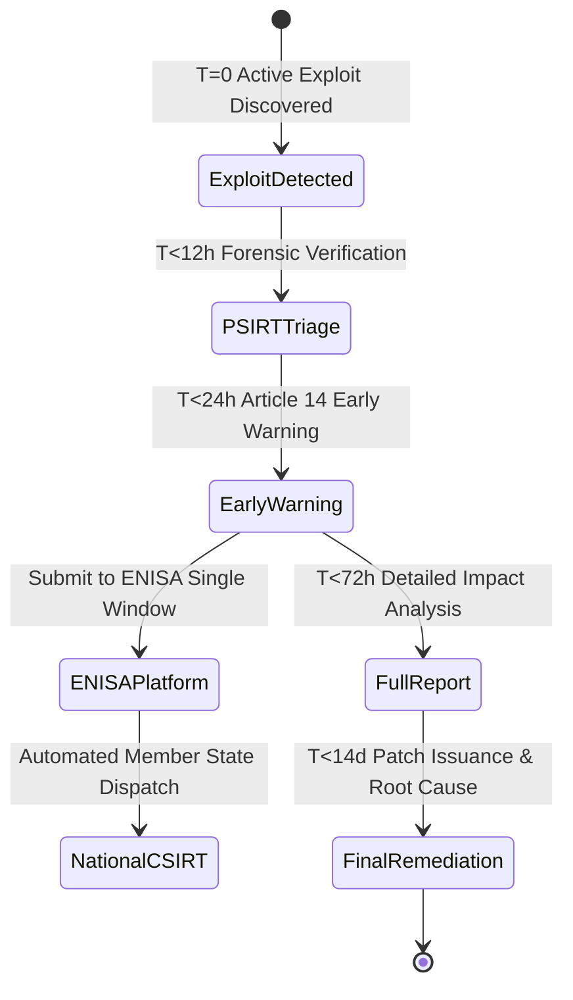

# The 24-Hour Early Warning Panic: Operationalizing the ENISA Single Reporting Platform
*By Jim Mckenney — Digital Product Security Consultant & Industrial OT Architect*

> **Executive Technical Memorandum:**
> - **Statutory Scope:** `Article 14(1)`
> - **Primary Persona:** `PSIRT Leads, Incident Response Managers, Corporate CISOs.` (`Plant CISOs & Asset Owners`)
> - **Curriculum Track:** `Vulnerability Operations, PSIRT & 24h Clocks` (Track 6)
> - **Regulatory Complexity:** `Advanced Engineering` • **Key Exposure:** `Article 14(1) Exposure`
> - **Companion Audio Briefing:** [EP_6.01 - Audio Broadcast (14:15)](https://oxot.ai/podcast) | [Standard Series RSS](https://oxot.ai/feeds/cra-podcast.xml)

---

## 1. The Commercial Dilemma & Industrial Reality

`[EP_6.01 - Strategic Technical Briefing] The 24-Hour Early Warning Panic: Operationalizing the ENISA Single Reporting Platform | Jim Mckenney`

**The Core Industry Problem:** When an unpatched zero-day is actively exploited in the wild, the manufacturer has exactly 24 hours to notify ENISA and the national CSIRT. How to build an operational workflow that doesn't trigger false alarms?

> *"*"The clock starts the second your team confirms active exploitation. Here is the step-by-step workflow to submit before hour 24."*"*

In industrial engineering and critical infrastructure operations, the arrival of **Regulation (EU) 2024/2847 (Cyber Resilience Act)** shatters historical procurement and maintenance assumptions. Stakeholders must recognize that commercial contracts, variation orders, and legacy supply chain models can no longer disclaim statutory cybersecurity conformity.

Under **Article 14(1)**, equipment placed on the European Single Market must satisfy mandatory cybersecurity baselines, maintain cryptographic technical files, and adhere to strict zero-day vulnerability notification timelines.

---

## 2. Key Strategic & Engineering Takeaways

1. **24h/72h reporting timeline map**
2. **ENISA Single Reporting Platform API integration**
3. **legal triage checklists**

---

## 3. Reference Architecture & Technical Implementation

The following domain-specific architecture illustrates the compliant engineering workflow, safe-harbor isolation boundary, and regulatory decision gate for `EP_6.01`:

---

## 4. Mandatory 4-Step Engineering Action Sprint

To ensure defensible compliance with **Article 14(1)**, organizations must execute the following structured remediation sprint:

1. **Conduct Asset & Contract Scope Audit:** Inventory all active hardware variants, firmware repositories, and supplier agreements across the operational footprint.
2. **Embed Statutory Safe-Harbor Clauses:** Insert CRA bilateral compliance warranties and 10-year technical dossier retention terms into upstream supplier and EPC subcontracts.
3. **Automate CycloneDX v1.6 SBOM Vaulting:** Implement automated CI/CD bill of materials generation with cryptographic code signing stored in an immutable 10-year archive.
4. **Operationalize Article 14 24h CSIRT Notification:** Conduct simulated drills for reporting actively exploited zero-days to the ENISA Single Reporting Platform within the mandatory 24-hour statutory window.

---

## 5. Statutory Cross-References & Legal Text

- **EU Cyber Resilience Act:** [Read Article 14(1) in the Interactive CRA Legal Wiki](http://localhost:8088/conformity/cra-wiki?tab=articles&num=14(1))
- **Audio Intelligence Platform:** [Listen to the Full Audio Episode](https://oxot.ai/podcast)
- **Technical Consultation:** [Schedule an Architecture Review with OXOT Advisory](http://localhost:8088/contact)
