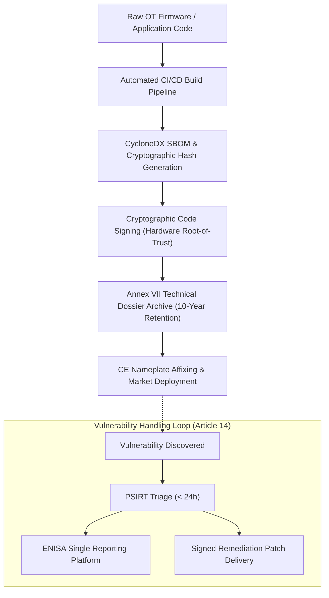

# Building an Annex I Compliant PSIRT: Roles, Playbooks & Tooling for Hardware OEMs
*By Jim Mckenney — Digital Product Security Consultant*

> **Executive Briefing Summary:**
> - **Primary Regulation:** Annex I Part II, Article 13(6) (Cyber Resilience Act)
> - **Target Audience:** `Product Security Directors & DevSecOps`
> - **Associated Podcast Episode:** [EP_6.02 - Solo Briefing](file:///Users/jimmcknney/Downloads/OXOT_Website_Conformity_Application/docs/cra_podcast/episodes_solo) | [Listen on Spotify](https://open.spotify.com)
> - **CRA Statutory Wiki Reference:** [Explore Annex I Part II, Article 13(6) on the Live CRA Wiki](http://localhost:8088/conformity/cra-wiki)

---

## 1. The Commercial Dilemma & Industrial Reality

In European industrial manufacturing, critical infrastructure, and software-defined automation, traditional engineering teams have historically treated cybersecurity as an operational IT concern. Under **Regulation (EU) 2024/2847 (The Cyber Resilience Act)**, that assumption is now a catastrophic legal liability.

When we examine the operational, commercial, and engineering reality of `Product Security Directors & DevSecOps`, the central challenge under **Annex I Part II, Article 13(6)** is clear: how to translate rigorous statutory requirements into defensible engineering architectures, machine-readable Software Bills of Materials (SBOMs), and robust supply-chain agreements.

---

## 2. Statutory Deep Dive: What Annex I Part II, Article 13(6) Actually Requires

Under European Union product harmonisation legislation, statutory duties attach directly to economic operators the moment a product with digital elements is placed on the EU single market.

```
+----------------------------------------------------------------------------------------------------+
| KEY STATUTORY REQUIREMENTS UNDER ANNEX I PART II, ARTICLE 13(6)                                            |
+---------------------+------------------------------------------------------------------------------+
| Essential Baseline  | Secure-by-default configuration, protection against unauthorized data access,|
| (Annex I Part I)    | attack surface minimization, and vulnerability resilience.                  |
+---------------------+------------------------------------------------------------------------------+
| Vulnerability SLA   | Mandatory 24-hour Early Warning and 72-hour Full Notification to ENISA and   |
| (Article 14)        | national CSIRTs for actively exploited zero-day vulnerabilities.            |
+---------------------+------------------------------------------------------------------------------+
| Documentation Duty  | 10-year retention of Annex VII Technical Files and CycloneDX/SPDX SBOMs.   |
| (Article 13)        |                                                                              |
+---------------------+------------------------------------------------------------------------------+
```

---

## 3. Recommended Technical Architecture

To satisfy Annex I Part II, Article 13(6) without disrupting factory floor operations or inflating bill-of-materials costs, industrial engineering teams should adopt the following reference architecture:



---

## 4. 4-Step Action Checklist for Engineering Teams

Execute the following four-stage engineering sprint to ensure full audit readiness:

1. **Step 1: Portfolio & Scope Audit** — Identify every active controller, firmware variant, and remote data processing connection governed by Annex I Part II, Article 13(6).
2. **Step 2: Supply Chain Risk Allocation** — Embed formal CRA compliance warranty clauses and SBOM delivery obligations into tier-2 component supplier contracts.
3. **Step 3: Technical Dossier & SBOM Verification** — Ensure all firmware builds output validated CycloneDX or SPDX SBOMs stored in an immutable 10-year archive.
4. **Step 4: PSIRT & CSIRT Dispatch Drills** — Conduct a dry-run incident response exercise simulating a 24-hour vulnerability notification to ENISA.

---

## 5. Listen to the Full Audio Episode

Stream the complete 14-minute single-voice briefing below or subscribe via your preferred podcast player:

* 🎧 **Direct Stream:** [Download Episode EP_6.02 Audio (MP3)](https://oxot.ai/audio/cra_podcast/EP_6.02.mp3)
* 📡 **RSS Feed:** `https://oxot.ai/feeds/cra-podcast.xml`
* 📖 **Verify Statutory Text:** [Open CRA Statutory Wiki](http://localhost:8088/conformity/cra-wiki)
