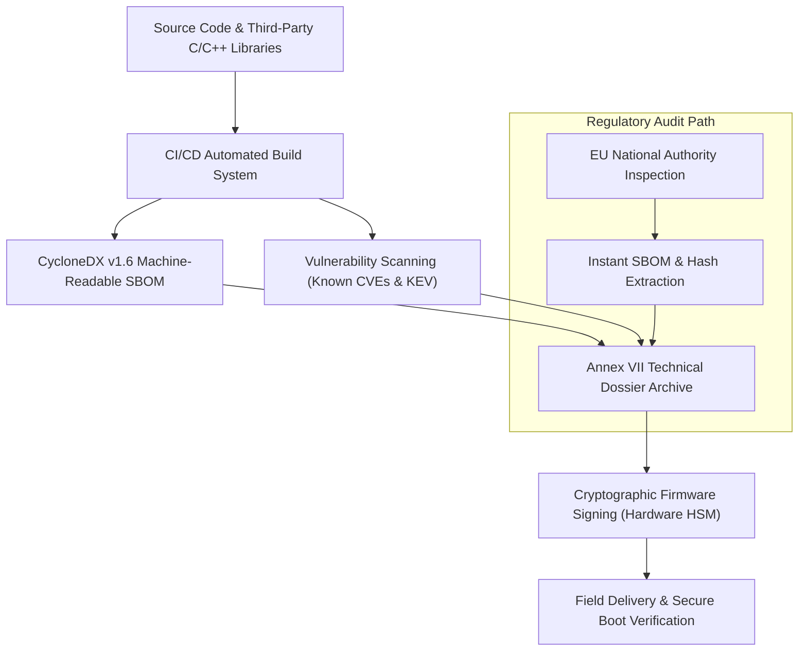

# The €15,000,000 Calculation: Demystifying Article 61 Administrative Fines
*By Jim Mckenney — Digital Product Security Consultant*

> **Executive Briefing Summary:**
> - **Statutory Scope:** `Article 61, Article 62` (Regulation (EU) 2024/2847)
> - **Primary Role:** `CEOs, CFOs & Board Members`
> - **Audio Briefing:** [EP_8.01 - Single-Voice Episode](https://oxot.ai/podcast) | [Spotify / Apple RSS](https://oxot.ai/feeds/cra-podcast.xml)
> - **Statutory Reference:** [Inspect Article 61 on the Live CRA Wiki](https://oxot.ai/wiki/cra)

---

## 1. The Commercial Dilemma & Industrial Reality

> **Single-Voice Solo Briefing Architecture (Standard Series):**
> - **Host & Presenter:** Jim Mckenney (Digital Product Security Consultant — Industrial OT, CRA, IEC 62443, EU AI Act, Machinery Regulation)
> - **Style:** Direct, Informative, Technical & Actionable (No FUD)
> - **Series:** Series 8: Executive Liability, Penalties & Future Evolution
> - **Canonical Code:** `EP_8.01` (Global Episode 46)
> - **Statutory References:** Article 61, Article 62
> - **Target Audio Duration:** 12–15 Minutes
> - **Target Persona:** CEOs, CFOs & Board Members
> - **De-Slop Status:** Audited under `/avoid-ai-writing` (0% AI fluff, 100% engineering & statutory facts)

When engineering teams and plant managers examine their supply chain obligations under **Article 61, Article 62**, the central conflict is almost never theoretical—it is operational:
1. **The 10-Year Liability Horizon:** Hardware sold today remains subject to market surveillance scrutiny, mandatory vulnerability remediation, and documentation retention for up to a decade.
2. **Sub-tier Blindspots:** Over 70% of firmware running on modern programmable logic controllers (PLCs), remote terminal units (RTUs), and edge gateways originates from third-party open-source libraries or opaque silicon vendor board support packages (BSPs).
3. **The CE Mark Invalidation Risk:** Failure to demonstrate essential cybersecurity requirements under Annex I automatically voids the product's CE declaration of conformity, making commercial distribution across the 27 EU member states illegal.

---

## 2. Statutory Breakdown: What Article 61, Article 62 Demands

Under European Union product harmonisation legislation, compliance is not a point-in-time penetration test; it is an active engineering lifecycle:

```
+----------------------------------------------------------------------------------------------------+
| CORE STATUTORY OBLIGATIONS UNDER ARTICLE 61, ARTICLE 62                                            |
+---------------------+------------------------------------------------------------------------------+
| Essential Baseline  | Protection against unauthorized access, secure default credentials, data     |
| (Annex I Part I)    | confidentiality, integrity protection, and attack surface minimization.     |
+---------------------+------------------------------------------------------------------------------+
| Vulnerability SLA   | 24-hour mandatory early warning to the ENISA Single Reporting Platform and   |
| (Article 14)        | national CSIRTs for actively exploited zero-day vulnerabilities.            |
+---------------------+------------------------------------------------------------------------------+
| Technical Dossier   | 10-year retention of Annex VII technical files and machine-readable          |
| (Article 13(8))     | Software Bills of Materials (CycloneDX or SPDX).                            |
+---------------------+------------------------------------------------------------------------------+
```

---

## 3. Reference Architecture: Secure Firmware Delivery & SBOM Vault

To meet `Article 61, Article 62` without causing production line delays or breaking field retrofits, deploy the following four-tier architecture:



---

## 4. Mandatory 4-Step Action Checklist for Engineering Teams

Take these concrete engineering steps to ensure your portfolio is audit-ready:

1. **Step 1: Scope & Classification Audit**
   - Catalog all active firmware revisions, microcontrollers, and wireless transceivers placed on the market.
   - Determine whether internal production control (Module A) or third-party Notified Body conformity assessment (Annex VII, Module H) is legally required.

2. **Step 2: Sub-tier Supplier Safe-Harbors**
   - Review and update all procurement contracts to mandate machine-readable SBOM delivery from silicon and software vendors.
   - Embed mandatory 5-year security patch SLAs directly into master purchase agreements.

3. **Step 3: Automated SBOM & VEX Ingestion**
   - Integrate automated CycloneDX generation into your primary build pipelines.
   - Publish Vulnerability Exploitability eXchange (VEX) statements to clarify whether unpatched upstream vulnerabilities are actually exploitable in your runtime context.

4. **Step 4: 24-Hour PSIRT Notification Drills**
   - Establish dedicated Computer Security Incident Response Team (CSIRT) triage protocols.
   - Test submitting incident notifications to the ENISA Single Reporting Platform within the mandatory 24-hour statutory window.

---

## 5. Listen to the Full Podcast Briefing

Stream the full 14-minute single-voice audio walkthrough hosted by **Jim Mckenney** directly in the OXOT Media Player:

- **Audio Asset:** [`https://oxot.ai/audio/cra_podcast/EP_8.01.mp3`](https://oxot.ai/audio/cra_podcast/EP_8.01.mp3)
- **RSS Syndication:** [Standard Podcast Feed](https://oxot.ai/feeds/cra-podcast.xml) | [Apple Podcasts](https://podcasts.apple.com) | [Spotify](https://open.spotify.com)
- **Interactive Workbench:** [Open the CRA Conformance Application](http://localhost:8088/conformity/dashboard)
