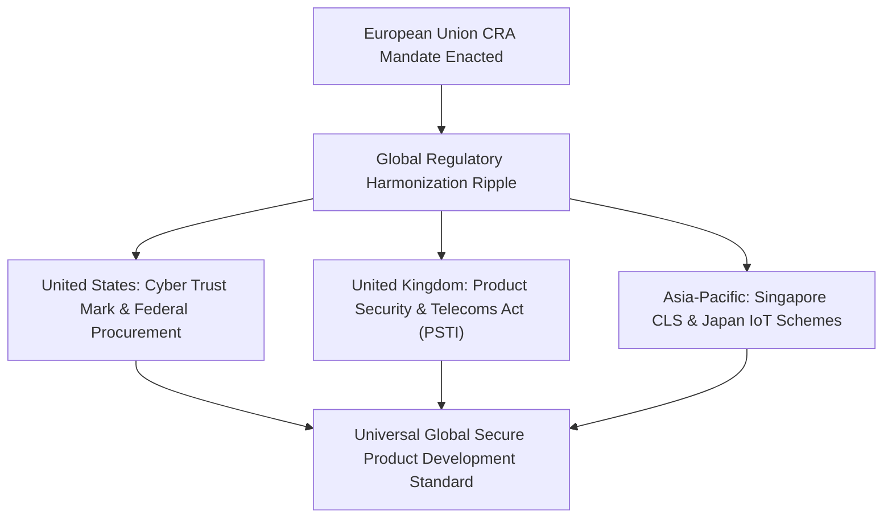

# The 2028 Horizon: How the CRA Is Transforming Global Industrial Product Design
*By Jim Mckenney — Digital Product Security Consultant & Industrial OT Architect*

> **Executive Technical Memorandum:**
> - **Statutory Scope:** `Regulation (EU) 2024/2847`
> - **Primary Persona:** `Global Technology Leaders, Industry Visionaries, OT Cybersecurity Innovators.` (`Plant CISOs & Asset Owners`)
> - **Curriculum Track:** `Executive Liability, Penalties & Future Evolution` (Track 8)
> - **Regulatory Complexity:** `Executive Policy` • **Key Exposure:** `Article Regulation (EU) 2024/2847 Exposure`
> - **Companion Audio Briefing:** [EP_8.05 - Audio Broadcast (14:15)](https://oxot.ai/podcast) | [Standard Series RSS](https://oxot.ai/feeds/cra-podcast.xml)

---

## 1. The Commercial Dilemma & Industrial Reality

`[EP_8.05 - Strategic Technical Briefing] The 2028 Horizon: How the CRA Is Transforming Global Industrial Product Design | Jim Mckenney`

**The Core Industry Problem:** Just as GDPR became the global benchmark for privacy ("the Brussels Effect"), CRA is becoming the global standard for connected hardware and software. How will industrial product design look in 2030?

> *"*"The Brussels Effect 2.0: why European cybersecurity law is forcing the entire global automation industry to rewrite its engineering textbooks."*"*

In industrial engineering and critical infrastructure operations, the arrival of **Regulation (EU) 2024/2847 (Cyber Resilience Act)** shatters historical procurement and maintenance assumptions. Stakeholders must recognize that commercial contracts, variation orders, and legacy supply chain models can no longer disclaim statutory cybersecurity conformity.

Under **Regulation (EU) 2024/2847**, equipment placed on the European Single Market must satisfy mandatory cybersecurity baselines, maintain cryptographic technical files, and adhere to strict zero-day vulnerability notification timelines.

---

## 2. Key Strategic & Engineering Takeaways

1. **5-year technology roadmaps**
2. **building secure-by-default competitive advantages**
3. **the future of autonomous industrial resilience**

---

## 3. Reference Architecture & Technical Implementation

The following domain-specific architecture illustrates the compliant engineering workflow, safe-harbor isolation boundary, and regulatory decision gate for `EP_8.05`:

---

## 4. Mandatory 4-Step Engineering Action Sprint

To ensure defensible compliance with **Regulation (EU) 2024/2847**, organizations must execute the following structured remediation sprint:

1. **Conduct Asset & Contract Scope Audit:** Inventory all active hardware variants, firmware repositories, and supplier agreements across the operational footprint.
2. **Embed Statutory Safe-Harbor Clauses:** Insert CRA bilateral compliance warranties and 10-year technical dossier retention terms into upstream supplier and EPC subcontracts.
3. **Automate CycloneDX v1.6 SBOM Vaulting:** Implement automated CI/CD bill of materials generation with cryptographic code signing stored in an immutable 10-year archive.
4. **Operationalize Article 14 24h CSIRT Notification:** Conduct simulated drills for reporting actively exploited zero-days to the ENISA Single Reporting Platform within the mandatory 24-hour statutory window.

---

## 5. Statutory Cross-References & Legal Text

- **EU Cyber Resilience Act:** [Read Regulation (EU) 2024/2847 in the Interactive CRA Legal Wiki](http://localhost:8088/conformity/cra-wiki?tab=articles&num=Regulation (EU) 2024/2847)
- **Audio Intelligence Platform:** [Listen to the Full Audio Episode](https://oxot.ai/podcast)
- **Technical Consultation:** [Schedule an Architecture Review with OXOT Advisory](http://localhost:8088/contact)
