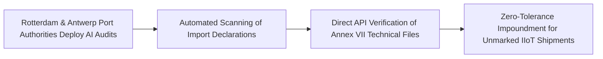

# Market Surveillance Port Interception Protocols Finalized at Rotterdam and Antwerp
*By Jim Mckenney — Digital Product Security Consultant & Industrial OT Architect*

> **Executive Technical Memorandum:**
> - **Statutory Scope:** `Article 54, Article 57`
> - **Primary Persona:** `Supply Chain & Logistics Directors` (`Importers & Distributors`)
> - **Curriculum Track:** `The CRA News Stream` (Track 10)
> - **Regulatory Complexity:** `Foundational` • **Key Exposure:** `Port Interception Protocol`
> - **Companion Audio Briefing:** [NEWS_04 - Audio Broadcast (02:50)](https://oxot.ai/podcast) | [Standard Series RSS](https://oxot.ai/feeds/cra-podcast.xml)

---

## 1. The Commercial Dilemma & Industrial Reality

`[NEWS_04 - Strategic Technical Briefing] Market Surveillance Port Interception Protocols Finalized at Rotterdam and Antwerp | Jim Mckenney`

**The Core Industry Problem:** Customs enforcement protocols for automated software bill of materials verification on non-EU embedded imports.

> *"Antwerp and Rotterdam customs finalize live digital inspection gates for industrial electronics arriving from outside the EU."*

In industrial engineering and critical infrastructure operations, the arrival of **Regulation (EU) 2024/2847 (Cyber Resilience Act)** shatters historical procurement and maintenance assumptions. Stakeholders must recognize that commercial contracts, variation orders, and legacy supply chain models can no longer disclaim statutory cybersecurity conformity.

Under **Article 54, Article 57**, equipment placed on the European Single Market must satisfy mandatory cybersecurity baselines, maintain cryptographic technical files, and adhere to strict zero-day vulnerability notification timelines.

---

## 2. Key Strategic & Engineering Takeaways

1. **Dutch and Belgian customs agencies have finalized automated verification gates for electronic product shipments entering the EU.**
2. **Importers unable to provide a machine-readable CycloneDX SBOM and valid EU Declaration of Conformity face immediate seizure.**
3. **Physical sampling will extract firmware binaries to match cryptographic hash signatures against submitted technical dossiers.**

---

## 3. Reference Architecture & Technical Implementation

The following domain-specific architecture illustrates the compliant engineering workflow, safe-harbor isolation boundary, and regulatory decision gate for `NEWS_04`:

---

## 4. Mandatory 4-Step Engineering Action Sprint

To ensure defensible compliance with **Article 54, Article 57**, organizations must execute the following structured remediation sprint:

1. **Conduct Asset & Contract Scope Audit:** Inventory all active hardware variants, firmware repositories, and supplier agreements across the operational footprint.
2. **Embed Statutory Safe-Harbor Clauses:** Insert CRA bilateral compliance warranties and 10-year technical dossier retention terms into upstream supplier and EPC subcontracts.
3. **Automate CycloneDX v1.6 SBOM Vaulting:** Implement automated CI/CD bill of materials generation with cryptographic code signing stored in an immutable 10-year archive.
4. **Operationalize Article 14 24h CSIRT Notification:** Conduct simulated drills for reporting actively exploited zero-days to the ENISA Single Reporting Platform within the mandatory 24-hour statutory window.

---

## 5. Statutory Cross-References & Legal Text

- **EU Cyber Resilience Act:** [Read Article 54, Article 57 in the Interactive CRA Legal Wiki](http://localhost:8088/conformity/cra-wiki?tab=articles&num=54)
- **Audio Intelligence Platform:** [Listen to the Full Audio Episode](https://oxot.ai/podcast)
- **Technical Consultation:** [Schedule an Architecture Review with OXOT Advisory](http://localhost:8088/contact)
