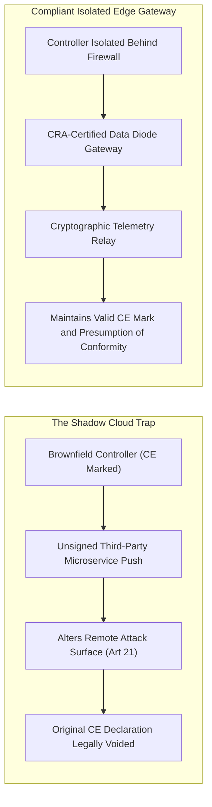

# The Edge-to-Cloud Grey Zone: When Microservices Void Local Controller CE Marks
*By Jim Mckenney — Digital Product Security Consultant & Industrial OT Architect*

> **Executive Technical Memorandum:**
> - **Statutory Scope:** `Article 3(2), Article 21`
> - **Primary Persona:** `Cloud-OT Architects & Plant CISOs` (`Plant CISOs & Asset Owners`)
> - **Curriculum Track:** `CRA: Truth & Consequences` (Track 9)
> - **Regulatory Complexity:** `Advanced Engineering` • **Key Exposure:** `CE Invalidation Risk`
> - **Companion Audio Briefing:** [TC_01 - Audio Broadcast (14:15)](https://oxot.ai/podcast) | [Standard Series RSS](https://oxot.ai/feeds/cra-podcast.xml)

---

## 1. The Commercial Dilemma & Industrial Reality

`[TC_01 - Strategic Technical Briefing] The Edge-to-Cloud Grey Zone: When Microservices Void Local Controller CE Marks | Jim Mckenney`

**The Core Industry Problem:** Shattering the myth that OTA container pushes are purely IT operations. Pushing an unsigned microservice or OTA runtime update to a field PLC alters its safety profile and legally voids its original CE mark.

> *"Pushing an unsigned container to a field controller isn't an agile update—it is an Article 21 Substantial Modification that voids your CE mark."*

In industrial engineering and critical infrastructure operations, the arrival of **Regulation (EU) 2024/2847 (Cyber Resilience Act)** shatters historical procurement and maintenance assumptions. Stakeholders must recognize that commercial contracts, variation orders, and legacy supply chain models can no longer disclaim statutory cybersecurity conformity.

Under **Article 3(2), Article 21**, equipment placed on the European Single Market must satisfy mandatory cybersecurity baselines, maintain cryptographic technical files, and adhere to strict zero-day vulnerability notification timelines.

---

## 2. Key Strategic & Engineering Takeaways

1. **Pushing an unsigned microservice or OTA runtime update to a field PLC alters its safety profile and legally voids its original CE mark.**
2. **Under Article 21, the cloud operator becomes the legal manufacturer, requiring a brand-new Annex VII technical dossier.**
3. **Deploy certified hardware data diodes and read-only telemetry taps to isolate cloud analytics from local control loops.**

---

## 3. Reference Architecture & Technical Implementation

The following domain-specific architecture illustrates the compliant engineering workflow, safe-harbor isolation boundary, and regulatory decision gate for `TC_01`:

---

## 4. Mandatory 4-Step Engineering Action Sprint

To ensure defensible compliance with **Article 3(2), Article 21**, organizations must execute the following structured remediation sprint:

1. **Conduct Asset & Contract Scope Audit:** Inventory all active hardware variants, firmware repositories, and supplier agreements across the operational footprint.
2. **Embed Statutory Safe-Harbor Clauses:** Insert CRA bilateral compliance warranties and 10-year technical dossier retention terms into upstream supplier and EPC subcontracts.
3. **Automate CycloneDX v1.6 SBOM Vaulting:** Implement automated CI/CD bill of materials generation with cryptographic code signing stored in an immutable 10-year archive.
4. **Operationalize Article 14 24h CSIRT Notification:** Conduct simulated drills for reporting actively exploited zero-days to the ENISA Single Reporting Platform within the mandatory 24-hour statutory window.

---

## 5. Statutory Cross-References & Legal Text

- **EU Cyber Resilience Act:** [Read Article 3(2), Article 21 in the Interactive CRA Legal Wiki](http://localhost:8088/conformity/cra-wiki?tab=articles&num=3(2))
- **Audio Intelligence Platform:** [Listen to the Full Audio Episode](https://oxot.ai/podcast)
- **Technical Consultation:** [Schedule an Architecture Review with OXOT Advisory](http://localhost:8088/contact)
