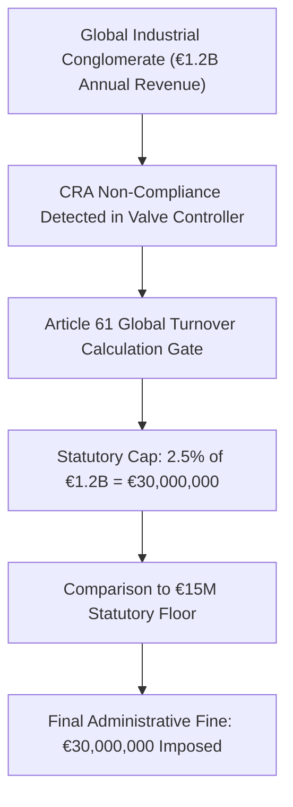

# The €15M Calculation: Dissecting the Math Behind Article 61 Global Turnover Penalties
*By Jim Mckenney — Digital Product Security Consultant & Industrial OT Architect*

> **Executive Technical Memorandum:**
> - **Statutory Scope:** `Article 61, Recital 78`
> - **Primary Persona:** `Chief Financial Officers & General Counsel` (`Procurement & Legal Counsel`)
> - **Curriculum Track:** `CRA: Truth & Consequences` (Track 9)
> - **Regulatory Complexity:** `Executive Policy` • **Key Exposure:** `€15M or 2.5% Turnover`
> - **Companion Audio Briefing:** [TC_04 - Audio Broadcast (14:40)](https://oxot.ai/podcast) | [Standard Series RSS](https://oxot.ai/feeds/cra-podcast.xml)

---

## 1. The Commercial Dilemma & Industrial Reality

`[TC_04 - Strategic Technical Briefing] The €15M Calculation: Dissecting the Math Behind Article 61 Global Turnover Penalties | Jim Mckenney`

**The Core Industry Problem:** Demystifying statutory fine mechanics: how market surveillance authorities aggregate corporate global turnover, supply chain failure scopes, and board liability.

> *"Article 61 penalties do not care about your regional profit margins—they calculate fines against your multinational parent company's gross worldwide turnover."*

In industrial engineering and critical infrastructure operations, the arrival of **Regulation (EU) 2024/2847 (Cyber Resilience Act)** shatters historical procurement and maintenance assumptions. Stakeholders must recognize that commercial contracts, variation orders, and legacy supply chain models can no longer disclaim statutory cybersecurity conformity.

Under **Article 61, Recital 78**, equipment placed on the European Single Market must satisfy mandatory cybersecurity baselines, maintain cryptographic technical files, and adhere to strict zero-day vulnerability notification timelines.

---

## 2. Key Strategic & Engineering Takeaways

1. **Article 61 fines are calculated against the parent entity's total worldwide consolidated annual turnover, not European subsidiary revenue.**
2. **Non-compliance with essential cybersecurity requirements triggers up to €15,000,000 or 2.5% of annual revenue, whichever is higher.**
3. **Corporate directors face personal liability under national transposition laws for systemic failures to maintain SBOM archives.**

---

## 3. Reference Architecture & Technical Implementation

The following domain-specific architecture illustrates the compliant engineering workflow, safe-harbor isolation boundary, and regulatory decision gate for `TC_04`:

---

## 4. Mandatory 4-Step Engineering Action Sprint

To ensure defensible compliance with **Article 61, Recital 78**, organizations must execute the following structured remediation sprint:

1. **Conduct Asset & Contract Scope Audit:** Inventory all active hardware variants, firmware repositories, and supplier agreements across the operational footprint.
2. **Embed Statutory Safe-Harbor Clauses:** Insert CRA bilateral compliance warranties and 10-year technical dossier retention terms into upstream supplier and EPC subcontracts.
3. **Automate CycloneDX v1.6 SBOM Vaulting:** Implement automated CI/CD bill of materials generation with cryptographic code signing stored in an immutable 10-year archive.
4. **Operationalize Article 14 24h CSIRT Notification:** Conduct simulated drills for reporting actively exploited zero-days to the ENISA Single Reporting Platform within the mandatory 24-hour statutory window.

---

## 5. Statutory Cross-References & Legal Text

- **EU Cyber Resilience Act:** [Read Article 61, Recital 78 in the Interactive CRA Legal Wiki](http://localhost:8088/conformity/cra-wiki?tab=articles&num=61)
- **Audio Intelligence Platform:** [Listen to the Full Audio Episode](https://oxot.ai/podcast)
- **Technical Consultation:** [Schedule an Architecture Review with OXOT Advisory](http://localhost:8088/contact)
