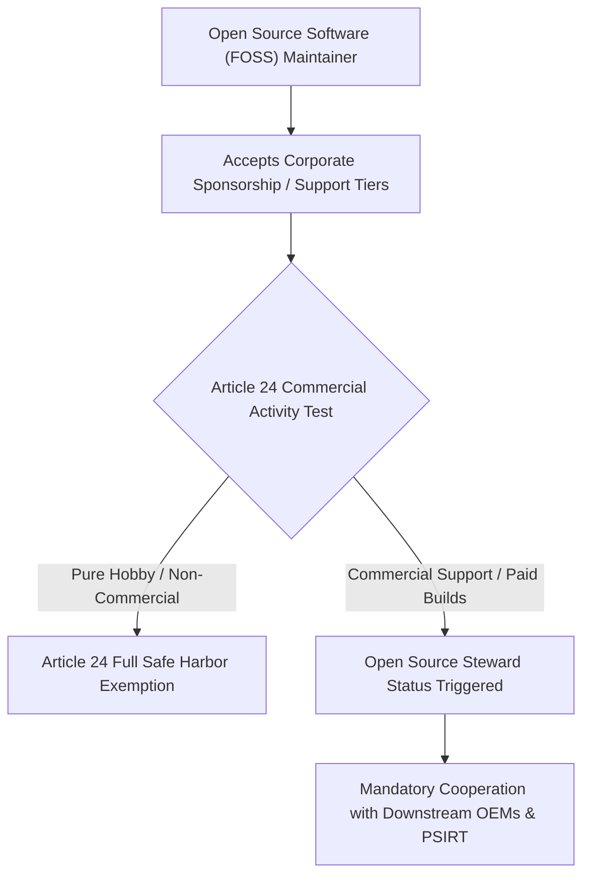

# The Open Source Stewardship Illusion: Navigating Article 24 Non-Commercial Safe Harbors
*By Jim Mckenney — Digital Product Security Consultant & Industrial OT Architect*

> **Executive Technical Memorandum:**
> - **Statutory Scope:** `Article 24, Article 33, Recital 18`
> - **Primary Persona:** `Open Source Maintainers & Software CTOs` (`Open Source Stewards`)
> - **Curriculum Track:** `CRA: Truth & Consequences` (Track 9)
> - **Regulatory Complexity:** `Legal Triage` • **Key Exposure:** `Article 33 Attestation`
> - **Companion Audio Briefing:** [TC_05 - Audio Broadcast (13:30)](https://oxot.ai/podcast) | [Standard Series RSS](https://oxot.ai/feeds/cra-podcast.xml)

---

## 1. The Commercial Dilemma & Industrial Reality

`[TC_05 - Strategic Technical Briefing] The Open Source Stewardship Illusion: Navigating Article 24 Non-Commercial Safe Harbors | Jim Mckenney`

**The Core Industry Problem:** The brutal reality of Article 33 stewardship and voluntary security attestations for foundations and dual-license projects.

> *"Thinking your open-source project is exempt? The moment you sell commercial support or enterprise tiers, the entire CRA regulatory burden attaches."*

In industrial engineering and critical infrastructure operations, the arrival of **Regulation (EU) 2024/2847 (Cyber Resilience Act)** shatters historical procurement and maintenance assumptions. Stakeholders must recognize that commercial contracts, variation orders, and legacy supply chain models can no longer disclaim statutory cybersecurity conformity.

Under **Article 24, Article 33, Recital 18**, equipment placed on the European Single Market must satisfy mandatory cybersecurity baselines, maintain cryptographic technical files, and adhere to strict zero-day vulnerability notification timelines.

---

## 2. Key Strategic & Engineering Takeaways

1. **Pure non-commercial open-source contributors enjoy safe-harbor, but commercializing via support contracts pulls code in-scope.**
2. **Open Source Stewards under Article 33 must establish formal security policies and single-point vulnerability intake channels.**
3. **Enterprise software vendors incorporating OSS components bear 100% downstream CRA liability for all embedded dependencies.**

---

## 3. Reference Architecture & Technical Implementation

The following domain-specific architecture illustrates the compliant engineering workflow, safe-harbor isolation boundary, and regulatory decision gate for `TC_05`:

---

## 4. Mandatory 4-Step Engineering Action Sprint

To ensure defensible compliance with **Article 24, Article 33, Recital 18**, organizations must execute the following structured remediation sprint:

1. **Conduct Asset & Contract Scope Audit:** Inventory all active hardware variants, firmware repositories, and supplier agreements across the operational footprint.
2. **Embed Statutory Safe-Harbor Clauses:** Insert CRA bilateral compliance warranties and 10-year technical dossier retention terms into upstream supplier and EPC subcontracts.
3. **Automate CycloneDX v1.6 SBOM Vaulting:** Implement automated CI/CD bill of materials generation with cryptographic code signing stored in an immutable 10-year archive.
4. **Operationalize Article 14 24h CSIRT Notification:** Conduct simulated drills for reporting actively exploited zero-days to the ENISA Single Reporting Platform within the mandatory 24-hour statutory window.

---

## 5. Statutory Cross-References & Legal Text

- **EU Cyber Resilience Act:** [Read Article 24, Article 33, Recital 18 in the Interactive CRA Legal Wiki](http://localhost:8088/conformity/cra-wiki?tab=articles&num=24)
- **Audio Intelligence Platform:** [Listen to the Full Audio Episode](https://oxot.ai/podcast)
- **Technical Consultation:** [Schedule an Architecture Review with OXOT Advisory](http://localhost:8088/contact)
