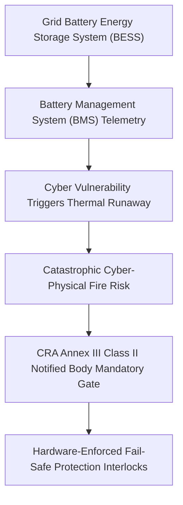

# Battery Energy Storage Systems (BESS): Cyber-Physical Fire Risks & Class II Notified Bodies
*By Jim Mckenney — Digital Product Security Consultant & Industrial OT Architect*

> **Executive Technical Memorandum:**
> - **Statutory Scope:** `Annex III Class II, IEC 61508`
> - **Primary Persona:** `Grid Battery Developers & Power OEMs` (`Hardware & Embedded OEMs`)
> - **Curriculum Track:** `CRA: Truth & Consequences` (Track 9)
> - **Regulatory Complexity:** `Advanced Engineering` • **Key Exposure:** `Thermal Runaway Cyber Risk`
> - **Companion Audio Briefing:** [TC_08 - Audio Broadcast (15:00)](https://oxot.ai/podcast) | [Standard Series RSS](https://oxot.ai/feeds/cra-podcast.xml)

---

## 1. The Commercial Dilemma & Industrial Reality

`[TC_08 - Strategic Technical Briefing] Battery Energy Storage Systems (BESS): Cyber-Physical Fire Risks & Class II Notified Bodies | Jim Mckenney`

**The Core Industry Problem:** How BMS firmware vulnerabilities cause thermal runaway battery fires, and why component silo certifications fail.

> *"A compromised BMS controller doesn't just leak data—it overheats lithium cells and burns down an industrial facility."*

In industrial engineering and critical infrastructure operations, the arrival of **Regulation (EU) 2024/2847 (Cyber Resilience Act)** shatters historical procurement and maintenance assumptions. Stakeholders must recognize that commercial contracts, variation orders, and legacy supply chain models can no longer disclaim statutory cybersecurity conformity.

Under **Annex III Class II, IEC 61508**, equipment placed on the European Single Market must satisfy mandatory cybersecurity baselines, maintain cryptographic technical files, and adhere to strict zero-day vulnerability notification timelines.

---

## 2. Key Strategic & Engineering Takeaways

1. **Battery Management System (BMS) controllers are Class II cyber-physical assets capable of inducing explosive thermal runaway.**
2. **Safety integrity level (SIL-3) hardware interlocks must be isolated from remote cloud-connected firmware update channels.**
3. **Third-party Notified Body audits must evaluate the complete integrated battery container, not isolated cell sub-components.**

---

## 3. Reference Architecture & Technical Implementation

The following domain-specific architecture illustrates the compliant engineering workflow, safe-harbor isolation boundary, and regulatory decision gate for `TC_08`:

---

## 4. Mandatory 4-Step Engineering Action Sprint

To ensure defensible compliance with **Annex III Class II, IEC 61508**, organizations must execute the following structured remediation sprint:

1. **Conduct Asset & Contract Scope Audit:** Inventory all active hardware variants, firmware repositories, and supplier agreements across the operational footprint.
2. **Embed Statutory Safe-Harbor Clauses:** Insert CRA bilateral compliance warranties and 10-year technical dossier retention terms into upstream supplier and EPC subcontracts.
3. **Automate CycloneDX v1.6 SBOM Vaulting:** Implement automated CI/CD bill of materials generation with cryptographic code signing stored in an immutable 10-year archive.
4. **Operationalize Article 14 24h CSIRT Notification:** Conduct simulated drills for reporting actively exploited zero-days to the ENISA Single Reporting Platform within the mandatory 24-hour statutory window.

---

## 5. Statutory Cross-References & Legal Text

- **EU Cyber Resilience Act:** [Read Annex III Class II, IEC 61508 in the Interactive CRA Legal Wiki](http://localhost:8088/conformity/cra-wiki?tab=articles&num=Annex III Class II)
- **Audio Intelligence Platform:** [Listen to the Full Audio Episode](https://oxot.ai/podcast)
- **Technical Consultation:** [Schedule an Architecture Review with OXOT Advisory](http://localhost:8088/contact)
