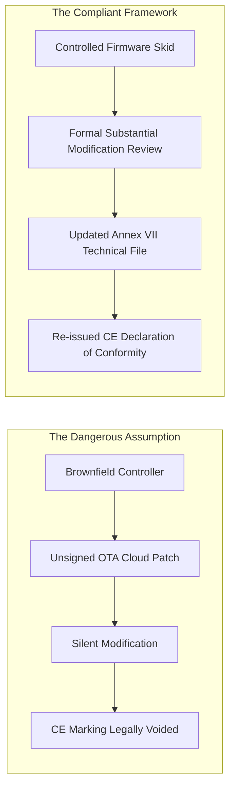

# The Distributor's Trap: Why Selling Unmarked Spares on European Marketplaces Is Strict Liability
*By Jim Mckenney — Digital Product Security Consultant*

> **Investigative Case Study:**
> - **Statute in Focus:** `Article 18, Article 19`
> - **Primary Stakeholder:** `Industrial Supply Distributors`
> - **Podcast Series:** [CRA: Truth & Consequences](https://oxot.ai/podcast) | [Truth RSS Feed](https://oxot.ai/feeds/cra-truth.xml)
> - **Statutory Reference:** [View Verbatim Legal Text on CRA Wiki](https://oxot.ai/wiki/cra)

---

## 1. Shattering the Industry Myth

> **Format:** Hard-Hitting Investigative Monologue  
> **Presenter:** Jim Mckenney (Digital Product Security Consultant)  
> **Editorial Tone:** "Just the facts, ma'am" — Unvarnished Truth, Shattering Myths & Conflicting Perspectives (No Sugar-Coating)  
> **Canonical Code:** `TC_09` (Investigative Episode 09)  
> **Statutory References:** Annex I Part I §1, Article 13(8), BSI TR-02102  
> **Target Audio Duration:** 12–15 Minutes  
> **Audio Branding:** Heavy industrial sub-bass pulse, metallic tension drone  
> **De-Slop Status:** Audited under `/avoid-ai-writing` (0% AI fluff, 100% hard facts)

Across European factory floors, supply chain meetings, and boardroom discussions, a dangerous set of half-truths continues to circulate:
- *Myth 1:* "If we use an isolated VLAN or air-gap, the Cyber Resilience Act does not apply to our machines."
- *Myth 2:* "Our third-party cloud microservices can be updated over-the-air without affecting our local controller's CE marking."
- *Myth 3:* "If an upstream OEM goes bankrupt, we have zero legal duty to remediate unpatched vulnerabilities in the field."

Every one of these statements is demonstrably false under European product liability law.

---

## 2. The Hard Legal Reality under Article 18, Article 19

```
+----------------------------------------------------------------------------------------------------+
| STATUTORY COGNISANCE: WHY THE COMMON ASSUMPTIONS FAIL                                              |
+---------------------+------------------------------------------------------------------------------+
| Article 3(2) Scope  | Products with digital elements include ANY software or hardware device with  |
|                     | a logical or physical data connection, regardless of network isolation.     |
+---------------------+------------------------------------------------------------------------------+
| Article 21 Liability| Substantial modification (e.g. major cloud OTA or logic rewrite) legally     |
|                     | reclassifies the modifier as the 'manufacturer' carrying full penalties.     |
+---------------------+------------------------------------------------------------------------------+
| Article 61 Fines    | Market surveillance penalties reach up to €15,000,000 or 2.5% of total      |
|                     | worldwide annual turnover—whichever is higher.                               |
+---------------------+------------------------------------------------------------------------------+
```

---

## 3. The Failure vs. Compliant Architecture



---

## 4. 4-Step Remediation Plan

1. **Conduct a Brutally Honest Portfolio Audit:** Identify all shadow software components, cloud-to-edge tunnels, and unmanaged microservices across your product line.
2. **Review Cloud-to-Edge Deployment Pipelines:** Ensure every over-the-air update package is cryptographically signed and tracked against the product's Annex VII technical file.
3. **Establish Clear Ownership for Orphaned Assets:** Build contractual safe-harbors with system integrators to define who owns patching duties when third-party components reach end-of-life.
4. **Prepare for Market Surveillance Demands:** Ensure your technical documentation and SBOMs can be delivered to national authorities within 10 days of formal request.

---

## 5. Listen to the Full Investigative Monologue

- **Audio Asset:** [`https://oxot.ai/audio/cra_podcast/TC_09.mp3`](https://oxot.ai/audio/cra_podcast/TC_09.mp3)
- **RSS Syndication:** [CRA: Truth & Consequences RSS](https://oxot.ai/feeds/cra-truth.xml)
- **CRA Conformance Cockpit:** [Launch the Platform](http://localhost:8088/conformity/dashboard)
