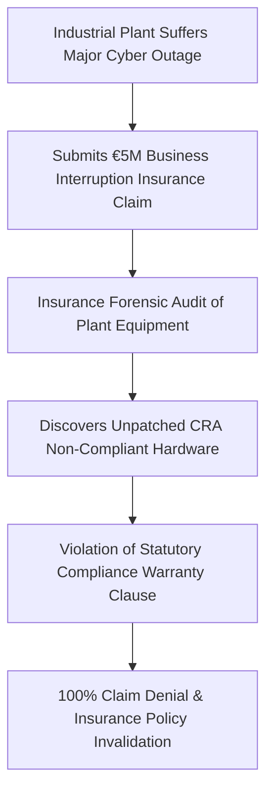

# The Insurance Underwriting Reckoning: How CRA Breaches Void Tech E&O and Cyber Policies
*By Jim Mckenney — Digital Product Security Consultant & Industrial OT Architect*

> **Executive Technical Memorandum:**
> - **Statutory Scope:** `Article 61, Product Liability Directive 2024/1828`
> - **Primary Persona:** `Corporate Risk Officers, CFOs & Legal Counsel` (`Procurement & Legal Counsel`)
> - **Curriculum Track:** `CRA: Truth & Consequences` (Track 9)
> - **Regulatory Complexity:** `Executive Policy` • **Key Exposure:** `100% Insurance Claim Denial`
> - **Companion Audio Briefing:** [TC_12 - Audio Broadcast (14:45)](https://oxot.ai/podcast) | [Standard Series RSS](https://oxot.ai/feeds/cra-podcast.xml)

---

## 1. The Commercial Dilemma & Industrial Reality

`[TC_12 - Strategic Technical Briefing] The Insurance Underwriting Reckoning: How CRA Breaches Void Tech E&O and Cyber Policies | Jim Mckenney`

**The Core Industry Problem:** How European insurance syndicates use CRA non-compliance to legally deny 100% of corporate cyber claims.

> *"File a €10M ransomware claim after an incident on an unpatched controller, and your insurer's forensic team will audit your CRA technical file to deny payout."*

In industrial engineering and critical infrastructure operations, the arrival of **Regulation (EU) 2024/2847 (Cyber Resilience Act)** shatters historical procurement and maintenance assumptions. Stakeholders must recognize that commercial contracts, variation orders, and legacy supply chain models can no longer disclaim statutory cybersecurity conformity.

Under **Article 61, Product Liability Directive 2024/1828**, equipment placed on the European Single Market must satisfy mandatory cybersecurity baselines, maintain cryptographic technical files, and adhere to strict zero-day vulnerability notification timelines.

---

## 2. Key Strategic & Engineering Takeaways

1. **Insurers are adding explicit 'Regulatory Conformity Exclusions' denying coverage for incidents originating on non-CRA hardware.**
2. **Under the revised EU Product Liability Directive, software is classified as a product with strict joint and several liability.**
3. **Maintain an immutable compliance audit trail to prove due diligence and preserve corporate Tech E&O insurance protections.**

---

## 3. Reference Architecture & Technical Implementation

The following domain-specific architecture illustrates the compliant engineering workflow, safe-harbor isolation boundary, and regulatory decision gate for `TC_12`:

---

## 4. Mandatory 4-Step Engineering Action Sprint

To ensure defensible compliance with **Article 61, Product Liability Directive 2024/1828**, organizations must execute the following structured remediation sprint:

1. **Conduct Asset & Contract Scope Audit:** Inventory all active hardware variants, firmware repositories, and supplier agreements across the operational footprint.
2. **Embed Statutory Safe-Harbor Clauses:** Insert CRA bilateral compliance warranties and 10-year technical dossier retention terms into upstream supplier and EPC subcontracts.
3. **Automate CycloneDX v1.6 SBOM Vaulting:** Implement automated CI/CD bill of materials generation with cryptographic code signing stored in an immutable 10-year archive.
4. **Operationalize Article 14 24h CSIRT Notification:** Conduct simulated drills for reporting actively exploited zero-days to the ENISA Single Reporting Platform within the mandatory 24-hour statutory window.

---

## 5. Statutory Cross-References & Legal Text

- **EU Cyber Resilience Act:** [Read Article 61, Product Liability Directive 2024/1828 in the Interactive CRA Legal Wiki](http://localhost:8088/conformity/cra-wiki?tab=articles&num=61)
- **Audio Intelligence Platform:** [Listen to the Full Audio Episode](https://oxot.ai/podcast)
- **Technical Consultation:** [Schedule an Architecture Review with OXOT Advisory](http://localhost:8088/contact)
