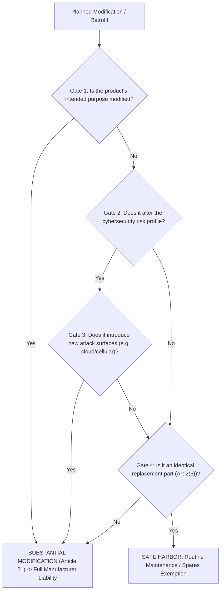

# Statutory Memorandum: Long-Lead Procurement, Spare Parts & Integrator Boundaries under CRA
## Legal & Engineering Guidance for Industrial EPCs, Asset Owners & Component Suppliers

**Regulation (EU) 2024/2847 (Cyber Resilience Act)**  
**Date:** 2026-08-14  
**Classification:** Statutory & Contractual Guidance Memorandum

---

## 1. Statutory Grounding: Key Provisions

```
+---------------------------------------------------------------------------------------------------------+
|                                      KEY CRA STATUTORY ANCHORS                                           |
+---------------------+-----------------------------------------------------------------------------------+
| STATUTE             | STATUTORY MANDATE & PRACTICAL EFFECT                                              |
+---------------------+-----------------------------------------------------------------------------------+
| Article 2(1)        | Scope: Applies to all products with digital elements whose intended use includes  |
|                     | direct/indirect logical or physical data connection to a device or network.       |
+---------------------+-----------------------------------------------------------------------------------+
| Article 2(6) &      | Spare Parts Exemption: CRA does NOT apply to spare parts manufactured to replace  |
| Recital 29          | identical components according to the exact same specifications.                  |
+---------------------+-----------------------------------------------------------------------------------+
| Article 13(8)       | Support Periods: Mandatory security updates for at least 5 years post-market.    |
+---------------------+-----------------------------------------------------------------------------------+
| Article 20(2)       | Duty to Refrain: Integrators/distributors must refrain from supplying/installing  |
|                     | equipment known to contain unaddressed critical vulnerabilities.                  |
+---------------------+-----------------------------------------------------------------------------------+
| Article 21 &        | Substantial Modification: Anyone carrying out modifications that affect security  |
| Recital 24          | compliance or intended purpose becomes the legal "Manufacturer."                  |
+---------------------+-----------------------------------------------------------------------------------+
| Article 71          | Entry into Force & Transitional Timeline: Full application on December 11, 2027;  |
|                     | Reporting obligations apply earlier on September 11, 2026.                        |
+---------------------+-----------------------------------------------------------------------------------+
```

---

## 2. Procurement Contracting: The 2024–2028 Transition Window

### A. The Placed-on-the-Market Rule vs. Contract Date
- Under European New Legislative Framework (NLF) case law and CRA Article 71:
  - **The trigger is the physical transfer or supply for distribution/use on the EU market.**
  - An EPC contract signed on **November 15, 2024** specifying pre-CRA equipment (e.g. Siemens S7-1500 FW v2.9 or Schneider M580) CANNOT be delivered into an EU facility on **January 15, 2028** without full CRA CE marking.
  - The supplier must either deliver a CRA-compliant hardware/firmware revision or the delivery is legally barred at customs and site delivery gates.

### B. Standard Contractual Transition Clauses (Model Language)
```markdown
### Model Clause 14.3: EU Cyber Resilience Act Compliance Warranty
"Supplier warrants and covenants that all Equipment, Subsystems, Hardware, and Software with digital elements delivered under this Agreement on or after December 11, 2027 (or such earlier date as mandated by Regulation (EU) 2024/2847) shall fully comply with all Essential Cybersecurity Requirements set forth in Annex I of Regulation (EU) 2024/2847, shall bear a valid CE mark with an accompanying EU Declaration of Conformity, and shall be accompanied by a machine-readable Software Bill of Materials (SBOM) in CycloneDX or SPDX format. Any engineering re-design, type-testing, or FAT/SAT adjustments required to achieve such compliance shall be borne solely by the Supplier without adjustment to the Contract Price or Delivery Schedule."
```

---

## 3. The 4-Gate Test for Substantial Modification (Article 21)

When an engineering integrator or maintenance team performs brownfield retrofits, apply this **4-Gate Evaluation Test**:



---

## 4. Upstream Component Supplier Survival Roadmap

For Tier-2/3 hardware and software suppliers:

1. **Do NOT apply for CE marks** if your product is a sub-assembly board or chip intended for integration into an OEM host device.
2. **Build a "Minimum Viable Security Kit" (MVSK)**:
   - Automated CycloneDX SBOM generation in your CI/CD pipeline.
   - Public Vulnerability Disclosure Policy (`security.txt`).
   - Secure boot and cryptographic implementation statement.
   - 5-year vulnerability patch commitment agreement.
3. **Insert Bilateral Risk Allocation Clauses** in OEM Master Supply Agreements (MSAs) capping component vendor liability to product purchase value rather than regulatory fine amounts.

---
*Persisted to OXOT Statutory Curation Vault • Date: 2026-08-14*
